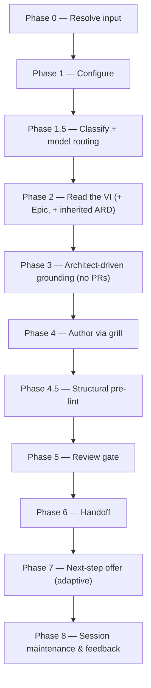

# create-ard:

Grounds on the mounted implementation repos — architect-driven discovery, no PRs — and authors an Architecture Requirements/Decision Document for a Value Increment or one of its Epics, reviewed before it lands.

## Who runs it

`create-ard:` runs in the [PA](../roles.md#pa-product-architecture) role — the one skill that introduces PA into the pipeline. PA is optional: a small, single-repo VI may genuinely not need an ARD at all, and Phase 0 offers an "optionality advisory" for exactly that case, letting the architect proceed anyway. This edition records no cost attribution, so there is no phase or role label on the run's output — see [Roles](../roles.md) for what PA owns and hands off at the seam.

## Synopsis

    create-ard: <VI-KEY> [<Epic-KEY>] [--no-docs]

`create-ard: <VI-KEY>` authors a **VI-level** ARD. `create-ard: <VI-KEY> <Epic-KEY>` authors an **Epic-level** ARD, which inherits the VI-level ARD read-only (Phase 2) and layers its own `[AD#N]` decisions on top — an Epic/area decision wins on conflict, and a real contradiction is caught by `ard-reviewer` at authoring time rather than left for a downstream consumer to resolve. A bare `<Epic-Key>` also resolves — the shared Jira-input front-end auto-resolves its parent VI. `--no-docs` turns off the optional Phase 3 documentation-grounding pass (on by default when `$DOCS_PATH` resolves).

## How it runs

`create-ard/SKILL.md` dispatches four subagents directly: `jira-reader` (Phase 2 — for a VI-level run, only when no authored VI file is present on the specs repo's default branch; for an Epic-level run, always, scoped to the Epic), `code-scanner` (Phase 3, one instance per confirmed repo, batches of up to 4 concurrent), `ard-reviewer` (Phase 5, caller-pinned to the strong reasoning tier — see [Gates](#gates)), and `impl-maintenance` (Phase 8, session lessons-learned). Phase 3's documentation grounding also reaches a fifth agent, `docs-grounder`, but indirectly, through the `dispatch-docs-grounder` procedure in [`skills/_shared/docs-grounding.md`](../../skills/_shared/docs-grounding.md), rather than being named as a direct dispatch inside `create-ard/SKILL.md` itself.

## What it needs

- **The VI on the specs repo's default branch** — gated via `require-on-main` against the VI file in `specifications/<VI>-<vslug>/`. An unmerged VI is a hard stop, naming the branch and any open pull request. An **absent** VI is not a stop: the run falls back to reading the Jira export directly through `jira-reader`, and reports that it did so.
- **`$SPECS_PATH`** (required) — if unset, the run stops naming `SPECS_PATH` and offers to enter a path or cancel.
- **A prior VI-level ARD**, when the run is Epic-level — resolved via [`skills/_shared/ard-resolution.md`](../../skills/_shared/ard-resolution.md). `status: found` inherits its `[AD#N]` invariants read-only; `status: unmerged` stops, naming the branch and any pull request; `status: none` (the common case for a first ARD) proceeds unchanged.
- **Mounted repos under `$REPOS_PATH`** — Phase 3's repo discovery is mandatory, not opt-in: it always lists the top-level directories under `$REPOS_PATH`, proposes a theme-to-repo mapping from the VI/Epic's capability themes, and asks the architect to confirm, correct, or add to it. A theme mapping to no obvious repo is asked about outright. A repo the architect can't mount is neither invented nor silently dropped — it is escalated (mount now and re-scan, ground only the confirmed-mounted set, or supply an absolute path) and, if descoped, recorded as an open question in the ARD rather than disappearing.
- **`$DOCS_PATH`** (optional, default `/workspace/docs`) — documentation grounding, consumed with grill-rank ranking. Missing, unreadable, or carrying no markdown file is a silent, non-blocking skip. Turned off explicitly with `--no-docs`.

`create-ard:` never reads a pull request — there are no PRs yet at architecture time — and it authors architecture only, never code.

## What it produces

`<VI>_ARD.md` for a VI-level run, or `<EPIC>_ARD.md` (or one `<EPIC>-<area>_ARD.md` per area, when Phase 4's per-area split is chosen for an Epic spanning separable components) for an Epic-level run — authored against [`skills/_shared/ard-format.md`](../../skills/_shared/ard-format.md), applying the no-hard-wrap prose convention, and written into the feature folder (`specifications/<VI>-<vslug>/`, or its `<EPIC>-<eslug>/` subfolder). Each `### [AD#N]` decision carries a `**Binds:**`, a `**Prevents:**`, and a testable `**Rule:**`. Behind Phase 6's consent choice, the ARD is committed, pushed, and a pull request opened against the specs repo's default branch.

`[AD#N]` decisions bind six downstream skills once the ARD is merged, each resolving it via [`skills/_shared/ard-resolution.md`](../../skills/_shared/ard-resolution.md): `create-ard:` itself (an Epic-level run inheriting its VI-level ARD), `design:`, `implement:`, [`specify:`](specify.md), [`epics:`](epics.md), and `ready:`. An `[AD#N]` `Rule` violated downstream without a recorded "ARD deviation" is a reviewer BLOCKER in whichever of those skills hit it.

## Gates

Phase 5 dispatches `ard-reviewer`. This agent carries no `model:` pin in its own frontmatter — the orchestrator pins the model at the dispatch call site (`task(model: <review_model>)`), recorded in `model_routing` as `review_model`, resolved from the strong reasoning tier (Opus 5/4.8/4.7/4.6 or GPT-5.6/5.5). It checks grounding integrity (every as-is claim cites a real `file:line`), `[AD#N]` well-formedness, non-contradiction of inherited VI-level invariants, altitude purity (no per-repo solutions at VI level), and recorded open questions. `PASS` / `PASS WITH RECOMMENDATIONS` proceeds. `BLOCK` triggers one inline fix cycle — the orchestrator/grill edits the ARD directly; there is no delegated fixer — and one re-review; if still `BLOCK`, each unresolved BLOCKER is escalated individually per [`skills/_shared/escalation-rules.md`](../../skills/_shared/escalation-rules.md). Cap: one fix cycle plus one re-review. For a per-area split, each area ARD is reviewed separately.

For `SIGNIFICANT` / `HIGH-RISK` classifications, Phase 1.5 additionally requires a resolved strong-reasoning model before the run proceeds at all — a tiered hard model gate: if none resolves, the run stops and offers to relaunch on one, override on the current model (logged in the final report), or cancel. For `SIMPLE`/`MODERATE`, a missing strong-reasoning model only degrades advisorially, recorded in `notes`.

Before the review, Phase 4.5 runs a structural pre-lint ([`skills/_shared/pre-lint.md`](../../skills/_shared/pre-lint.md)) — advisory only, never blocking — that inline-fixes mechanical issues (a duplicate `[AD#N]`, a stray placeholder token) and leaves content gaps for the grill and the author to close.

## Example

Author a VI-level ARD, grounding on the repos the VI's themes point at:

    create-ard: PRODUCT-1234

The run resolves the VI (from the merged VI file if present, else the Jira export), lists top-level directories under `$REPOS_PATH`, proposes a theme-to-repo mapping and asks you to confirm it, scans the confirmed repos with `code-scanner`, grills you relentlessly through Context, Grounding findings, Architecture decisions, Cross-repo approach, Stack & invariants, Edge cases & risks, and Open questions, runs the structural pre-lint, then `ard-reviewer`. On a passing verdict it offers to branch, commit, push, and open a pull request, then offers the adaptive next step — a hand to PE, `epics: PRODUCT-1234` if the VI has no Epics yet, or `specify: PRODUCT-1234` otherwise.

## See also

- [Roles](../roles.md) — what the PA role owns, an optional phase in the pipeline that `create-ard:` alone introduces.
- [`create-vi:`](create-vi.md) — the upstream skill that authors the VI `create-ard:` reads.
- [`epics:`](epics.md) and [`specify:`](specify.md) — the two downstream skills Phase 7 offers, each of which consults the merged ARD once it lands.
- [`model-routing.md`](../../skills/_shared/model-routing.md) — the classification and model-fallback chain `ard-reviewer` runs under, plus the tiered hard model gate `create-ard:` applies for `SIGNIFICANT`/`HIGH-RISK` runs.
- [`ard-format.md`](../../skills/_shared/ard-format.md) — the canonical structure the ARD is authored and reviewed against.
- [`ard-resolution.md`](../../skills/_shared/ard-resolution.md) — how the six downstream skills resolve and inherit `[AD#N]` invariants.
