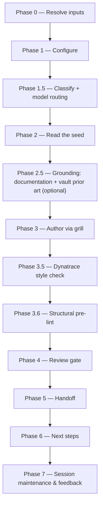

# create-vi:

Turns a refined `idea.md` plus a user-supplied Jira key into a high-quality, product-level Value Increment, gated by an Opus (or GPT-5.6/5.5) review.

## Who runs it

`create-vi:` runs in the [PM](../roles.md#pm-product-management) role. This edition records no cost attribution, so there is no phase or role label on the run's output — see [Roles](../roles.md) for what PM owns and hands off at the seam.

## Synopsis

    create-vi: <JIRA-KEY> [@idea.md] [--from-vi <VI-KEY|path>] [--lean|--hybrid|--full] [--no-docs] [--no-prior-art]

- **`<JIRA-KEY>`** (mandatory) — the key of an empty Jira workitem the user already created to get the ID. Format-validated only (`^[A-Z][A-Z0-9_]*-\d+$`); zero Jira API means its existence on the tracker is never checked.
- **`[@idea.md]`** (optional) — an explicit path to the idea source; see [What it needs](#what-it-needs) for how this differs from the default resolution.
- **`[--from-vi <VI-KEY|path>]`** (optional) — seed a **new** VI (still under the positional `<JIRA-KEY>`) with another VI's structure, read read-only as grounding and adapted, never copied wholesale.
- **`[--lean|--hybrid|--full]`** — the profile controlling which adapt-in clusters are available; default `--hybrid`. `--full` is required for `[FR#N]` Functional Requirements; `--hybrid`/`--full` for `[UC#N]` Use Cases.
- **`[--no-docs]`** / **`[--no-prior-art]`** — each turns off one optional grounding source (Phase 2.5).

## How it runs

`create-vi/SKILL.md` dispatches two subagents directly: `vi-reviewer` (Phase 4, caller-pinned to the strong reasoning tier — see [Gates](#gates)) and `impl-maintenance` (Phase 7, session lessons-learned). Phase 2.5's grounding also reaches two more agents — `docs-grounder` and `vault-prior-art-finder` — dispatched **in a single response** so they run in parallel, but indirectly, through the `dispatch-docs-grounder` and `dispatch-prior-art-finder` procedures in [`skills/_shared/docs-grounding.md`](../../skills/_shared/docs-grounding.md) and [`skills/_shared/vault-prior-art.md`](../../skills/_shared/vault-prior-art.md), rather than being named as a direct dispatch inside `create-vi/SKILL.md` itself. A further agent, `dt-style-guide:dt-style-checker`, runs in Phase 3.5 when the separate `dt-style-guide` plugin is installed — a non-gating quality pass, not counted above because it ships in a different plugin and is skipped gracefully when that plugin is absent.

## What it needs

- **`<JIRA-KEY>`** — mandatory; absent or malformed stops the run with `CREATE_VI_NEEDS_KEY`, naming the required `create-vi: <KEY> @<idea.md>` form.
- **`idea.md`**, resolved by a five-rung ladder that stops at the first hit (Phase 0). **The first two rungs gate differently, and the difference is easy to miss:**
  - **In-contract — `<KEY>`'s own feature folder.** This is the default when no `@path` is given. It is gated via `require-on-main`: absent falls through to the next rung without stopping (`idea:` is not a prerequisite for `create-vi:`); present and merged onto the specs repo's default branch is used as-is, never relocated again (`idea:` already did that); present on an unmerged plugin branch is a hard stop, naming the branch and any open pull request.
  - **Out-of-contract — an explicit `@<path>` argument.** Read exactly where it sits — never relocated, never gated via `require-on-main` at all — and reported once as out-of-contract.
  - The remaining rungs (a same-session `idea:` output, a picker over recently-discovered `idea.md` files under `$VAULT_PATH/Projects`, or a manual path) are all out-of-contract, handled the same way as `@<path>`. If every rung is exhausted, the run proceeds with no idea and grills the VI from scratch.
- **`$SPECS_PATH`** (required) — if unset, the run stops naming `SPECS_PATH` and offers to enter a path or cancel.
- **An existing VI for `<KEY>`**, checked by a frontmatter glob in the feature folder. `create-vi:` is greenfield-only: if one is found, the run redirects to [`update-vi: <KEY>`](update-vi.md) (or, with `--from-vi`, offers to update the existing VI instead of seeding a fresh one).
- **The `--from-vi` seed** (optional) — resolved Jira-import-first with a 3-day freshness check; used read-only, never as content to copy.
- **Documentation grounding and vault prior art** (optional, on by default) — each turned off with `--no-docs` / `--no-prior-art`; a miss of either is always a silent skip, never a gate.
- **No repos.** `create-vi:` is cwd-agnostic and product-level — it never mounts or scans code.

## What it produces

`<KEY>_<slug>.md`, written to `$SPECS_PATH/specifications/<KEY>-<slug>/` (the feature folder is auto-created on first write), authored against [`skills/_shared/vi-format.md`](../../skills/_shared/vi-format.md) for the chosen profile. Frontmatter carries the propagated `sources`, `derived_from` (the idea's own path), `seeded_from_vi` (only when `--from-vi` was used), and `jira_key`. Behind Phase 5's consent choice, the VI is committed, pushed, and a pull request opened against the specs repo's default branch. The VI itself is **not yet visible to Jira** until the manual round-trip: paste the body into the Jira workitem `<KEY>`, then re-import it to `$VAULT_PATH/jira-products/<KEY>` — without both steps the downstream pipeline cannot read it.

## Gates

- **Phase 3.5 — Dynatrace style check** (`dt-style-guide:dt-style-checker`, when that plugin is installed). A quality enhancement, not a gate: MAJOR findings are fixed inline and the checker re-runs once; remaining MINOR/NIT findings are only reported. Skipped gracefully, with a note in the final report, when `dt-style-guide` is not installed.
- **Phase 3.6 — Structural pre-lint** ([`skills/_shared/pre-lint.md`](../../skills/_shared/pre-lint.md), run inline, no agent). Advisory only — mechanical findings are fixed inline, content gaps are left for the grill; it never blocks.
- **Phase 4 — `vi-reviewer`.** Unlike a Claude edition, this agent carries no `model:` pin in its own frontmatter — the orchestrator pins the model at the dispatch call site (`task(model: <review_model>)`), recorded in `model_routing` as `review_model`, resolved from the strong reasoning tier (Opus 5/4.8/4.7/4.6 or GPT-5.6/5.5). It reviews the whole VI against [`skills/_shared/vi-format.md`](../../skills/_shared/vi-format.md). `PASS` / `PASS WITH RECOMMENDATIONS` proceeds. `BLOCK` triggers one inline fix cycle and one re-review; if still `BLOCK`, each unresolved BLOCKER is escalated per [`skills/_shared/escalation-rules.md`](../../skills/_shared/escalation-rules.md)'s "Review verdict BLOCK" choices (provide manual fix notes, defer to a follow-up issue, override and accept, or cancel). If no strong-reasoning model resolves at all, the run degrades to the best available model and records the degradation rather than hard-blocking.

**Deliberately not captured:** `release_versions`, `change_type`, and `release_notes_category` are Jira-mirror fields — set as Jira dropdowns on the ticket and returned by the importer on the round-trip, never authored here. `vi-reviewer` neither requires nor validates them; `release-notes:` reads two of the three (`change_type` and `release_notes_category`) from the import, and explicitly never parses `release_versions`.

## Example

    create-vi: PRODUCT-1234 @idea.md --hybrid

The run resolves the feature folder, reads `idea.md` directly (no `idea-reader` — it is the plugin's own format), grounds it against docs and vault prior art, grills you relentlessly through the spine (Problem, Goal, Target audience, User Stories, Acceptance Criteria, Scope, Success Metrics) plus any adapt-in clusters the idea warrants, runs the style check and pre-lint, then `vi-reviewer`. On a passing verdict it offers to branch, commit, push, and open a pull request, and reminds you to paste the VI into Jira and re-import it.

## See also

- [Roles](../roles.md) — what the PM role owns and hands off at the seam.
- [`idea:`](idea.md) — the upstream skill that authors and relocates the `idea.md` this skill consumes.
- [`update-vi:`](update-vi.md) — where an already-existing VI for `<KEY>` is refreshed instead.
- [`create-ard:`](create-ard.md) and [`epics:`](epics.md) — the two role handoffs Phase 6 offers.
- [`model-routing.md`](../../skills/_shared/model-routing.md) — the classification and model-fallback chain `vi-reviewer` runs under.
- [`vi-format.md`](../../skills/_shared/vi-format.md) — the canonical structure the VI is authored and reviewed against.
