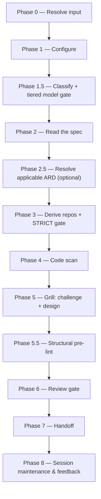

# design:

Takes over a merged `specification.md`, grounds strictly in the fully-mounted implementation code, and authors a reviewed engineering `design.md` through a relentless grill that challenges the spec and designs the implementation.

## Who runs it

`design:` runs in the [Dev](../roles.md#dev-build-verify-and-deliver) role. This edition records no cost attribution, so there is no phase or role label on the run's output — see [Roles](../roles.md) for what Dev owns and hands off at the seam.

## Synopsis

    design: <VI-Key | Epic-Key | dir> [<Epic-Key>] [--design-twice]

`design:` is jira-driven only — a `mode: direct` prompt stops with `DESIGN_NEEDS_JIRA`, since it uses the shared front-end only to parse the grammar and classify the key, never to read Jira content: the requirements source of truth is the merged `specification.md` in the specs repo, not a fresh Jira read. Given `<VI>` alone, Phase 0 step 4 (Granularity) resolves what to design from what already exists in the specs repo: a flat `specification.md` at the VI dir (a stand-alone Epic, or a broad VI-level spec) needs no picker; Epic subfolders render a **progress-aware picker** — one row per **spec'd** Epic (○ not started / ◐ in progress, resuming from `_design-session.md` / ● done, offering *revise*), plus an excluded-count note for any Epic whose `specification.md` doesn't exist yet or isn't merged to the default branch. An explicit `<VI> <Epic>` (or `<dir> <Epic>`) skips the picker entirely. `--design-twice` forces Phase 5's three-way interface fan-out on the run's load-bearing interface even when no contested-interface signal fired.

## How it runs

`design/SKILL.md` carries 12 `## Phase` headings and dispatches four subagents directly: `code-scanner` (Phase 4, batches of up to 4 concurrent, over the STRICT-gated confirmed repo set), `interface-designer` (Phase 5, three parallel takes — offered on a contested-interface signal, forced by `--design-twice`), `design-reviewer` (Phase 6, caller-pinned to the strong reasoning tier — see [Gates](#gates)), and `impl-maintenance` (Phase 8, session lessons-learned). No indirect dispatch reaches a fifth agent here: `design:` cites `ard-resolution.md` (Phase 2.5) and several other `skills/_shared/` procedures, but none of them dispatch a subagent of their own, and — unlike [`specify:`](specify.md) and [`create-ard:`](create-ard.md) — `design:` does not consume `docs-grounding.md` at all, so `docs-grounder` never enters the picture here. The grill and the `design.md` authoring itself run inline on `current_model` rather than through a delegated subagent.

## What it needs

- **A Jira VI or Epic** via the shared front-end — a `mode: direct` prompt is rejected outright (`DESIGN_NEEDS_JIRA`); `design:` has no direct-prompt behavior.
- **`$SPECS_PATH`** (required) — `design:` reads `specification.md` and writes `design.md` under `$SPECS_PATH/specifications/`; unset stops the run naming `SPECS_PATH`.
- **The `specification.md` on the specs repo's default branch** — `design:` is the one hard exception to the pipeline's "absent falls back" rule: an unmerged spec is a hard stop naming the branch and any open pull request, and an **absent** spec is *also* a hard stop (`no specification.md exists yet — run specify: for it and merge it to the specs repo main first`), never a silent fallback.
- **A tiered model gate** (Phase 1.5) — stricter than [`implement:`](implement.md)'s, because the critical synthesis here is inline rather than delegated to an Opus subagent: on SIGNIFICANT/HIGH-RISK work, a non-Opus session is a **hard gate** requiring relaunch on Opus (resumable from `_design-session.md`); on SIMPLE/MODERATE it's a soft advisory only.
- **An optional ARD** for this item (Phase 2.5), resolved via [`skills/_shared/ard-resolution.md`](../../skills/_shared/ard-resolution.md). `status: none` skips silently; `status: unmerged` stops, naming the branch and any pull request; `status: found` carries the invariants forward as guardrails the design is authored within — a necessary deviation is recorded in `design.md`'s own `## ARD deviations` section rather than editing the ARD — and passed to `design-reviewer` as `applicable_ard`.
- **Mounted repos under `$REPOS_PATH`** — Phase 3's gate is **STRICT**: any confirmed repo that isn't mounted hard-stops the whole run (unlike [`specify:`](specify.md)'s soft gate), because a design cannot ground implementation decisions in code it cannot read.
- **A prior `_design-session.md`** (optional) — if one exists in the resolved feature folder, Phase 1 offers resume-vs-fresh.

## What it produces

`design.md` (flat, alongside `specification.md`), authored against [`skills/_shared/design-format.md`](../../skills/_shared/design-format.md); the amended `specification.md` (its own new `## Engineering review` notes and spec-level open questions — annotate-only, never mutating `[Uxx]`/`[ACxx]`/`[TCxx]` IDs, when the spec is `Published: yes`); `_design-session.md`; and `_design-glossary.md`. Phase 7 **refuses to hand off a `design.md` with any unresolved `- [ ]`** — the design is the last gate before code. Behind Phase 7's consent choice, the feature folder is branched, committed, pushed, and a pull request opened against the specs repo's default branch (`prefix: design`); merged-to-main is what makes `design.md` visible to [`implement:`](implement.md), which reads it from the default branch only. A per-Epic design completed from a multi-Epic VI's picker offers to loop straight into the next sibling Epic.

## Gates

Phase 6 dispatches `design-reviewer`. Like every other Opus reviewer in this pipeline, it carries no `model:` pin of its own — the orchestrator pins the model at the dispatch call site (`task(model: <review_model>)`), resolved from the strong reasoning tier (Opus 5/4.8/4.7/4.6 or GPT-5.6/5.5) and recorded as `review_model`. It checks architecture/interface/seam/test-strategy soundness, coverage of every in-scope requirement, and decision-completeness — treating **any unresolved `design.md` open question as a BLOCKER by policy**. `BLOCK` fixes the BLOCKER findings inline (the orchestrator/grill edits `design.md` directly — no delegated writer) and re-reviews once; an unresolved BLOCKER after that cycle is escalated individually. `PASS` / `PASS WITH RECOMMENDATIONS` proceeds, with MAJOR/MINOR/NIT findings deferred to the final report. Cap: one fix cycle plus one re-review.

Ahead of the review, Phase 5.5 runs a structural pre-lint ([`skills/_shared/pre-lint.md`](../../skills/_shared/pre-lint.md)) — advisory only — checking the Universal checks plus the design block (core headings present; a MODERATE+ design carries `## Seams` or a stated `_N/A — why_`; the `## Open questions` `- [ ]` count).

## Example

Design a single, already-selected Epic:

    design: PRODUCT-1234 EPIC-98761

The run resolves the VI and the named focus Epic (skipping the picker, since it was given explicitly), confirms `specification.md` is merged to the default branch, resolves any applicable ARD, derives and STRICT-gates the confirmed implementation repos (every one must be mounted), scans them in parallel, then grills you relentlessly — recording every substantive challenge into the spec's own `## Engineering review` section while authoring `design.md` section by section, offering the three-way interface fan-out on any contested interface. It runs the structural pre-lint, then `design-reviewer`. On a passing verdict with zero open questions it offers to branch, commit, push, and open a pull request; merged-to-main is what [`implement:`](implement.md) waits for.

## See also

- [Roles](../roles.md) — "The handover model" names `design:`'s absent-`specification.md` hard stop as the one exception to the pipeline's usual "absent input falls back" rule.
- [`specify:`](specify.md) — the upstream skill whose `specification.md` `design:` takes over; the requirements source of truth this skill never re-reads from Jira.
- [`create-ard:`](create-ard.md) — the optional upstream skill whose `[AD#N]` invariants `design:` inherits when present.
- [`implement:`](implement.md) — the downstream skill that plans and builds from `design.md` once it's merged to the specs repo's default branch.
- [`model-routing.md`](../../skills/_shared/model-routing.md) — the classification rules, the tiered model gate, and the `design-reviewer` strong-reasoning pin.
- [`design-format.md`](../../skills/_shared/design-format.md) — the canonical structure `design.md` is authored against, including the `## Seams` contested-interface signals that trigger the interface fan-out.
- [`ard-resolution.md`](../../skills/_shared/ard-resolution.md) — how the optional ARD is resolved and inherited.
