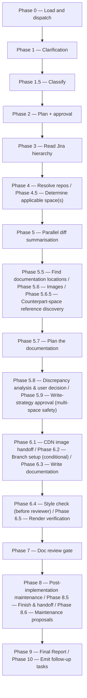
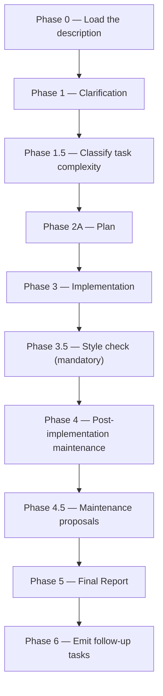

# document:

Reads a Jira Value Increment hierarchy, resolves PR diffs in parallel, and synthesises product documentation into a docs repository — gated on a mandatory style check and an Opus review — or, in its lighter direct mode, makes a one-shot edit to an existing page.

## Who runs it

`document:` runs in the [Dev](../roles.md#dev-build-verify-and-deliver) role. This edition records no cost attribution, so there is no phase or role label on the run's output — see [Roles](../roles.md) for what Dev owns and hands off at the seam.

## Synopsis

    document: <JIRA_KEY> [saas|managed] [--counterpart <JiraID|PR-url>]     # Mode A — Jira-driven
    document: <@file | free text>                                          # Mode B — direct edit

The first argument token decides the mode via the shared front-end: a JiraID (`^[A-Z][A-Z0-9]+-[0-9]+`), optionally followed by `saas`/`managed`, or a directory that inspects as a Jira export, resolves `jira-driven` → **Mode A**; a leading `@file`, free-text prose, or any other directory resolves `direct` → **Mode B**. The optional second token in Mode A is a **space constraint**, not a target list: passing `saas` or `managed` documents only that space and leaves the other space's render unchanged; omitting it lets Phase 4.5 determine and confirm the applicable space(s) from Jira text, resolved-repo leanings, and any specs hint. `both` is not itself a valid value — omit the argument to cover both spaces. `--counterpart <JiraID | PR-url>` is valid only on a space-constrained run: it points Phase 5.6.5 at the *other* space's existing documentation as read-only grounding (never an image source, never copied into the target doc).

## How it runs

`document/SKILL.md` carries 35 `## Phase` headings in total — 25 in **Mode A** and 10 in **Mode B** — and each mode numbers its own phases starting at 0, so the same phase number means something different depending on mode (Mode A's Phase 4 is "Resolve repos"; Mode B's Phase 4 is "Post-implementation maintenance"). A single flat diagram across all 35 would conflate the two, so this page draws one diagram per mode.

### Mode A — Jira-driven

Mode A's 25 phases are collapsed below into 15 diagram nodes for readability, grouping only phases that form one user-visible step — every heading is still quoted verbatim, including Phase 6.2's own `(conditional)` marker.

### Mode B — direct edit

Mode B's 10 phases are small enough to show one per node, with no collapsing.

`document/SKILL.md` dispatches ten subagents directly, most in Mode A only: `jira-reader` (Mode A Phase 3, `depth: full`), `diff-summarizer` (Mode A Phase 5, one instance per repo, batches of up to 4 concurrent), `doc-location-finder` (Mode A Phase 5.5), `counterpart-finder` (Mode A Phase 5.6.5, only on a space-constrained run), `doc-planner` (Mode A Phase 5.7, caller-pinned to the strong reasoning tier — see [Gates](#gates)), `doc-writer` (Mode A Phase 6.3, caller-pinned to the same tier — the delegated writer), `doc-reviewer` (Mode A Phase 7 only — Mode B has no reviewer gate), and three agents shared by both modes: `docs-style-checker` (Mode A Phase 6.4 / Mode B Phase 3.5, mandatory in both), `doc-fixer` (fixing style violations and, in Mode A only, surviving review findings), and `impl-maintenance` (Mode A Phase 8 / Mode B Phase 4, session lessons-learned). No indirect dispatch reaches an eleventh agent — unlike [`specify:`](specify.md) and [`epics:`](epics.md), `document:` does not consume `docs-grounding.md` at all (this edition's own convention scopes that reference to the seven authoring commands, deliberately excluding `document:`). One further agent, `dt-style-guide:dt-style-checker`, runs — when the separate `dt-style-guide` plugin is installed — *inside* `docs-style-checker`'s own execution as a complementary semantic / cross-page-consistency pass; it isn't counted above because `document:` never dispatches it directly, `docs-style-checker` does so internally, and it ships in a different plugin, skipped gracefully when absent. Mode B additionally spawns `general-purpose` agents (Phase 2A exploration; Phase 4's documentation/knowledge-base/instructions maintenance sweep) — a Copilot CLI built-in agent type, not a `dev-workflows:` one.

## What it needs

**Mode A (Jira-driven):** a Jira VI/Epic export resolved via the shared front-end; the docs repo resolved cwd-preferred against a documented signals list (`package.json` build/lint scripts, `.docstack/`, `mkdocs.yml`, `docusaurus.config.js`, `antora.yml`, `.vale.ini`, `DOCUMENTATION-GUIDELINES.md`, or a `_snippets/` dir), confirmed writable, or the run asks where to write; a docs-profile resolved in-repo → the built-in dynatrace-docs default → an on-demand inline `docs-profile:` run whose branch this run then adopts; a toolchain preflight deriving the required tool set from the profile, the repo's own config signals, and its documented Prerequisites, prompting (Cancel recommended) only when something's missing; and mounted repos matched to the Jira PRs' repo slugs under `$REPOS_PATH`, gated by one **consolidated** repo gate (never one prompt per missing repo).

**Mode B (direct edit):** an `@file` path or free-text description; no Jira input, no docs-profile, no space determination — classification is always SIMPLE or MODERATE, and Opus is never invoked. Its toolchain preflight is lighter, scoped to `style_check` only, using just the repo's own config signals and documented Prerequisites (there's no profile to derive a build/render requirement from).

**Both modes:** `$SPECS_PATH` for the run's own bookkeeping only (`specs-preflight` / `commit-artifacts`) — the `specs` list the front-end resolves is additive context, never a gate.

## What it produces

**Mode A:** one or more product-docs pages under the resolved `docs_repo_path`, traceable via the run's return payload and commit message — never a Jira key or PR URL inline in the rendered page. Write context (`obsidian` / `docs_repo` / `non_docs_repo` / `plain_dir`) governs whether Phase 6.2 branches and whether the orchestrator commits `doc-writer`'s output at all. When it does, Phase 8.5 squashes the run into clean history, offers a push, and writes a copy-paste PR draft — no API call anywhere (Bitbucket has no CLI to open one; GitHub gets an optional `gh pr create` one-liner to run yourself). A bug-report draft (`<KEY>-implementation-gaps.md`) is written to the ticket's vault project folder when Phase 5.8 records a `document-as-spec`, `skip-and-report`, or qualifying `document-as-code` decision.

**Mode B:** edits to the existing page(s) in the current working tree, left **uncommitted** — the user manages git manually; no branch, no PR draft.

**Both modes:** the terminal `commit-artifacts` step commits only `$SPECS_PATH`'s bounded session-artifact paths — never the docs repo either mode just wrote into.

## Gates

**Mode A:** Phase 6.4's `docs-style-checker` is mandatory and runs before Phase 7's review gate. It climbs a ladder internally — the repo's own primary linter (Vale, etc.), then `dt-style-checker` as a complementary semantic pass when the `dt-style-guide` plugin is installed — merging and deduping both finding sets; `document:` never invokes `dt-style-checker` separately. Phase 7 then dispatches `doc-reviewer`, which — like every other Opus reviewer in this pipeline — carries no `model:` pin of its own: the orchestrator pins the model at the dispatch call site (`task(model: <review_model>)`), resolved from the strong reasoning tier and recorded as `review_model`. Findings are triaged first ([`finding-triage.md`](../../skills/_shared/finding-triage.md)) before any `doc-fixer` dispatch. `BLOCK` invokes `doc-fixer` for BLOCKER/MAJOR findings, checks its `Stop condition flag`, and — only on `CLEAR` — re-reviews once passing the fixer's report back as `claims_file`; an unresolved BLOCKER after that cycle is escalated individually. `PASS WITH RECOMMENDATIONS` invokes `doc-fixer` for MAJOR findings only. `PASS` proceeds. Cap: one fix cycle plus one re-review. Every gate this run touches — `toolchain_preflight`, `style_check`, `repo_checklist`, `source_truth_verification`, `build_check`, `render_smoke_check` — appends a row to the run's `gate_ledger` the moment it completes ([`gate-ledger.md`](../../skills/_shared/gate-ledger.md)); a missing row or an unconverted `UNAVAILABLE` is itself a `doc-reviewer` BLOCKER.

**Mode B:** `docs-style-checker` (Phase 3.5) is mandatory, but there is **no `doc-reviewer` gate** — direct mode is deliberately lightweight: a style check plus `doc-fixer`, no Opus review, and no finding triage (a linter violation is a deterministic match with nothing to trace).

## Example

Document a Jira Value Increment across both spaces:

    document: PRODUCT-1234

The run resolves the VI, resolves the docs repo and its profile, runs the toolchain preflight, plans and gets approval, reads the full Jira hierarchy, resolves the PR repos behind one consolidated gate, determines and confirms the applicable space(s), summarises the PR diffs in parallel batches of up to 4, finds write locations, gathers and reviews screenshots (both new candidates and existing-image staleness), plans the documentation via `doc-planner`, resolves any Jira-vs-spec-vs-code discrepancies, sets up the branch, dispatches `doc-writer`, runs the mandatory style check and render verification, then `doc-reviewer`. On a passing verdict it squashes, offers to push, and writes a copy-paste PR draft — merged is what makes the docs live.

A small, self-contained fix uses Mode B instead:

    document: @path/to/notes.md

## See also

- [Roles](../roles.md) — the Dev role; `document:` (Mode A) is the heaviest of the four Dev-role skills in this batch.
- [`epics:`](epics.md) — the sibling skill for writing child Epic drafts instead of product documentation.
- `release-notes:` — the downstream skill for the customer-facing announcement, once every Epic under the VI is documented (not yet a written page in this doc tree).
- `docs-profile:` — the skill Phase 0 runs inline, on demand, for a custom docs repo with no profile yet (not yet a written page in this doc tree).
- [`model-routing.md`](../../skills/_shared/model-routing.md) — the classification rules and the `doc-planner` / `doc-writer` Opus pins.
- [`gate-ledger.md`](../../skills/_shared/gate-ledger.md) — the six-outcome verification-gate accounting every Mode A gate writes a row against.
- [`source-truth.md`](../../skills/_shared/source-truth.md) — the Jira-vs-spec-vs-code discrepancy-escalation protocol Phase 5.8 runs.
- [`doc-structure-conventions.md`](../../skills/_shared/doc-structure-conventions.md) — the traceability boundary: no Jira key, PR URL, or provenance comment lives in a rendered page.
- [`finish-and-handoff.md`](../../skills/_shared/finish-and-handoff.md) — the squash, push, and copy-paste PR draft mechanics Phase 8.5 runs.
