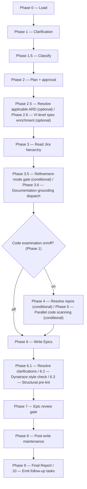

# epics:

Reads a Value Increment and its existing Epics from exported markdown, optionally scans code repos for reuse and gaps, and drafts child Epic definitions reviewed before they're handed back to you.

## Who runs it

`epics:` runs in the [PE](../roles.md#pe-product-engineering) role. This edition records no cost attribution, so there is no phase or role label on the run's output — see [Roles](../roles.md) for what PE owns and hands off at the seam.

## Synopsis

    epics: <VI-KEY | dir> [<Epic-KEY>] [--no-docs]

The positional input resolves through the shared Jira-input front-end: a **VI JiraID** (requires `$VAULT_PATH`), or a **jira-export directory** (works without it). `epics:` is **jira-driven only** — a plain prompt with no Jira input stops with `EPICS_NEEDS_JIRA`. An optional trailing **Epic key** narrows the run to refining that one Epic (`focus_key`): Phase 3.5's refinement-mode gate then treats it, and any detected empty "team-Epic shell" linked to the VI, as a fill-in target rather than a non-duplication constraint. `--no-docs` turns off the optional Phase 3.6 documentation-grounding dispatch.

## How it runs

`epics/SKILL.md` carries 19 `## Phase` headings. The diagram below keeps every phase but collapses the ones that form one user-visible step, and shows the one real fork that changes which phases run at all: whether code examination is on.

`epics/SKILL.md` dispatches six subagents directly: `jira-reader` (Phase 3, `depth: vi-plus-epics`), `code-scanner` (Phase 5, one instance per confirmed repo, up to 4 concurrent per batch, only when code examination is ON), `epic-writer` (Phase 6, the sole author of the Epic drafts — caller-pinned to the detection chain for a `MODERATE` run, or to the strong-reasoning chain for `SIGNIFICANT`/`HIGH-RISK`), `doc-fixer` (Phases 6.2 and 7, fixing style violations and surviving BLOCKER/MAJOR review findings), `epic-reviewer` (Phase 7, caller-pinned to the strong reasoning tier — see [Gates](#gates)), and `impl-maintenance` (Phase 8, session lessons-learned). Phase 3.6's documentation grounding also reaches a seventh agent, `docs-grounder`, but indirectly, through the `dispatch-docs-grounder` procedure in [`skills/_shared/docs-grounding.md`](../../skills/_shared/docs-grounding.md), rather than being named as a direct dispatch inside `epics/SKILL.md` itself. A further agent, `dt-style-guide:dt-style-checker`, runs in Phase 6.2 as the primary style checker for the Epic drafts — a non-gating quality pass, not counted above because it ships in a different plugin and is skipped gracefully when that plugin is absent.

## What it needs

- **A Jira VI or Epic** via the shared front-end — a `mode: direct` prompt is rejected outright (`EPICS_NEEDS_JIRA`); `epics:` has no non-Jira behavior.
- **An optional VI-level `specification.md`** (Phase 2.6) — `require-on-main`-gated. **Absent** is a silent skip (`vi_spec_present: false`) — the common case, since [`specify:`](specify.md) usually runs per-Epic after `epics:` — with no prompt and no extra output. **Unmerged** is a hard stop, naming the branch and any open pull request: a spec that exists but hasn't landed on the default branch is a weaker grounding basis than the one about to arrive.
- **An optional VI-level ARD** (Phase 2.5), resolved via [`skills/_shared/ard-resolution.md`](../../skills/_shared/ard-resolution.md) with `epic: null` (Epics don't exist yet). `status: none` skips silently and proceeds exactly as before; `status: unmerged` stops, naming the branch and any pull request; `status: found` carries its `[AD#N]` invariants into both `epic-writer` and `epic-reviewer`.
- **`$DOCS_PATH`** (optional, default `/workspace/docs`) — resolved in Phase 2, deliberately before the Phase 2.5/2.6 gates, because it is the run's only consent-bearing step (an index build or a capped refresh) and must resolve before any of the run's real work. Missing, unreadable, or empty is a silent, non-blocking skip. Turned off with `--no-docs`.
- **Mounted repos under `$REPOS_PATH`** — only consulted when code examination is ON (the Phase 1 default). The repo list is auto-derived from sibling/parent Epics' `## Pull Requests` sections, or entered manually. A repo slug that resolves to zero matches is escalated, never silently dropped; an entirely empty resolved list still lets the run proceed without a code scan if you choose to.

## What it produces

One `.md` file per new or refined Epic, under the resolved output directory: `$VAULT_PATH/jira-drafts/<jira_key>/` when `$VAULT_PATH` is set, or a derived `epic-drafts/<jira_key>/` beside the imported hierarchy otherwise — deliberately outside `jira-products/`, which is wiped on every Jira re-import. `epic-writer` also writes `_coverage.md` (VI-holistic requirement coverage; never pasted to Jira). Refined team-Epic files are keyed by their real Jira id (`<EPIC-KEY>.md`); net-new drafts are slug-named.

`epics:` never creates a branch, and never commits the Epic drafts themselves. Its git writes are confined to `$SPECS_PATH`, and only to its bounded session-artifact paths — git hygiene of the write target (the vault, or the derived output directory) is your own responsibility.

## Gates

Phase 7 dispatches `epic-reviewer`. Like `ard-reviewer`, this agent carries no `model:` pin of its own — the orchestrator pins the model at the dispatch call site, resolved from the strong reasoning tier (Opus 5/4.8/4.7/4.6 or GPT-5.6/5.5) and recorded as `review_model`. It checks goal clarity, acceptance-criteria testability, scope boundaries, and non-duplication with existing Epics under the parent VI. Findings are triaged first — each verified at the location it names, every dismissal recorded with a reason, survivors only handed to `doc-fixer`. `BLOCK` invokes `doc-fixer` for BLOCKER/MAJOR findings and re-reviews once, passing the fixer's own report back as `claims_file` so the re-review falsifies the fixer's account rather than assuming it; an unresolved BLOCKER after that cycle is escalated individually. `PASS WITH RECOMMENDATIONS` fixes MAJOR findings only; `PASS` proceeds. Cap: one fix cycle plus one re-review.

Ahead of the review, Phase 6.2 runs `dt-style-guide:dt-style-checker` as the **primary** style checker — not a fallback, since Epic drafts are vault-internal with no repo-side prose linter to fall back from. It is skipped gracefully, with a note in the final report, when the separate `dt-style-guide` plugin is not installed. Phase 6.3 then runs a structural pre-lint ([`skills/_shared/pre-lint.md`](../../skills/_shared/pre-lint.md)) — advisory only, checking required headings, Given/When/Then acceptance criteria, and the `[NEEDS CLARIFICATION]` cap.

## Example

Split a VI with two existing Epics not yet covering all of its scope:

    epics: PRODUCT-1234

The run resolves the VI, asks for the output directory and whether to scan code (default on, repos auto-derived from sibling Epics' PR links), resolves any VI-level ARD and specification, reads the Jira hierarchy at `vi-plus-epics` depth, scans the confirmed repos in batches of up to 4, delegates the drafting to `epic-writer`, runs the Dynatrace style check and structural pre-lint, then `epic-reviewer`. On a passing verdict it reports the Epics written and `_coverage.md`'s gap list, and recommends `specify: <VI> <Epic>` per drafted Epic as the next step — Epic drafting itself was never committed, so publishing the Epics to Jira remains a manual step.

## See also

- [Roles](../roles.md) — what the PE role owns, including `epics:`'s Phase 2.6 gate, which always targets the VI dir's `specification.md` rather than a nested per-Epic one, since Epics don't exist yet when `epics:` runs.
- [`create-vi:`](create-vi.md) and [`create-ard:`](create-ard.md) — the upstream skills whose VI, and optional ARD, `epics:` reads.
- [`specify:`](specify.md) — the downstream skill normally run once per drafted Epic; a VI with 0 Epics that reaches `specify:` first is itself offered a link back to `epics:`, but nothing gates the order.
- [`model-routing.md`](../../skills/_shared/model-routing.md) — the classification rules and the `epic-reviewer` strong-reasoning pin.
- [`ard-resolution.md`](../../skills/_shared/ard-resolution.md) — how the optional VI-level ARD is resolved and inherited.
- [`docs-grounding.md`](../../skills/_shared/docs-grounding.md) — the `dispatch-docs-grounder` procedure Phase 3.6 reaches indirectly.
