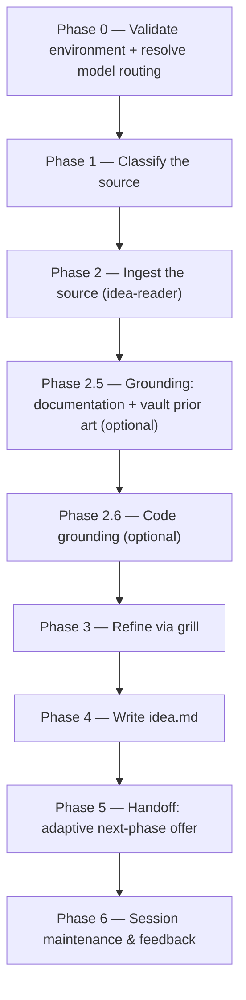

# idea:

Refines one raw source — a prompt, a file, a community post, or an exported Jira ticket — into a lean `idea.md` brief that seeds the future [`create-vi:`](create-vi.md).

## Who runs it

`idea:` runs in the [PM](../roles.md#pm-product-management) role. This edition records no cost attribution, so there is no phase or role label on the run's output — see [Roles](../roles.md) for what PM owns and hands off at the seam.

## Synopsis

    idea: <prompt | @file | JIRA-KEY> [--deep] [--ground-code [<repo>,…]] [--no-docs] [--no-prior-art]

The argument — everything typed after the `idea:` trigger, minus every recognised flag — is classified into one of three source forms (Phase 1), by precedence:

- **An inline prompt** — plain text with no recognised flag; the argument text itself becomes the raw idea.
- **A markdown file or `@wikilink`** — an existing `.md` path, including a community post (typically under `Projects/Products/…`, tagged `community-post`) or a previously-written `idea.md` handed back for re-refinement.
- **An exported Jira ticket** — a key matching `^[A-Z][A-Z0-9_]*-\d+$`, resolved via `resolve-export-for-key` and then typed from the export's own `issue_type` frontmatter, never from the project prefix: `ValueIncrement` reads as **vi** — an existing VI, prior art the user supplied; `Product Need` reads as **rfe** — product feedback; any other `issue_type` is named to the user, who chooses, defaulting to `vi`.

Four flags: `--deep` switches the grill from bounded (≤10 questions) to relentless (runs to convergence, no cap); `--ground-code [<repo>[,<repo>…]]` turns on the optional Phase 2.6 code-grounding scan — bare, the repo set is derived from mounted directories and the idea's themes; given a value, it scans exactly the named repos (the token after the flag counts as a repo list only when it has no whitespace and every comma-separated part matches a mounted top-level directory basename — otherwise the flag is bare and the token is idea text); `--no-docs` turns off documentation grounding; `--no-prior-art` turns off vault prior-art discovery.

## How it runs

`idea/SKILL.md` dispatches three subagents directly: `idea-reader` (Phase 2, ingests the source), `code-scanner` (Phase 2.6, one instance per confirmed repo, batches of up to 4 concurrent, only when `--ground-code` is given, with a seeded round 2 for any theme round 1 left inconclusive), and `impl-maintenance` (Phase 6, session lessons-learned). All three run at the caller's `detection_model`; the interactive grill and the authoring itself run inline on the session's own `current_model` rather than through a delegated subagent. Phase 2.5's grounding also reaches two more agents — `docs-grounder` and `vault-prior-art-finder` — but indirectly, through the `dispatch-docs-grounder` and `dispatch-prior-art-finder` procedures in [`skills/_shared/docs-grounding.md`](../../skills/_shared/docs-grounding.md) and [`skills/_shared/vault-prior-art.md`](../../skills/_shared/vault-prior-art.md), rather than being named as a direct dispatch inside `idea/SKILL.md` itself.

## What it needs

- **`$VAULT_PATH`** — must be set, an existing directory, and writable before anything else runs (Phase 0). If any check fails, the run stops and offers to enter a directory to write `idea.md` into, or cancel — it never falls back to the current working directory, which may be a code repo. This is an environment halt, not a plugin-gap halt.
- **The idea source itself** — read by `idea-reader`. A Jira key that does not resolve, or a path that does not exist, stops the run and offers to re-enter the source or cancel.
- **`$DOCS_PATH`** (optional, default `/workspace/docs`) — documentation grounding. Missing, unreadable, or carrying no markdown file is a silent, non-blocking skip: `docs grounding: OFF`, never an error. Turned off explicitly with `--no-docs`.
- **Vault prior art** (optional, on by default) — searches the vault for tracked initiatives this idea should be reconciled against. Turned off with `--no-prior-art`, or silently OFF when it cannot resolve (for example an invalid `$VAULT_PATH`); advisory only, never a gate.
- **`--ground-code` repo(s)** (optional) — only runs when the flag is given. A named repo that is not mounted is neither invented nor silently dropped — it is escalated and, if declined, carried forward by name with its themes left unverified. With no flag at all, the run does one cheap detection pass and prints at most one advisory line naming a repo the idea mentions; it never scans.
- **`$SPECS_PATH`** — not needed to start the run at all; an unresolvable path is a silent no-op rather than a stop. It is touched twice: the specs-repo preflight runs against it at the end of Phase 0 (which can emit a guard notice), and it becomes load-bearing from Phase 5 onward, once a Jira key has resolved and `idea.md` is relocated there for the git handoff.

## What it produces

`idea.md`, authored against [`skills/_shared/idea-format.md`](../../skills/_shared/idea-format.md). While the run is keyless it is written under `$VAULT_PATH` — by default at `<container(source path)>/<candidate_slug>/idea.md`, where the container follows the vault prior-art derivation in [`skills/_shared/vault-prior-art.md`](../../skills/_shared/vault-prior-art.md): a source already grouped under `Projects/Products/` lands beside its neighbours; everything else resolves to `Projects/ideas/`. Once a Jira key resolves, Phase 5 relocates the file to `$SPECS_PATH/specifications/<KEY>-<slug>/idea.md` and, behind a consent choice, hands it off onto the specs repo's default branch (opening a pull request) or reports it as relocated-but-not-yet-handed-off if the user declines.

**Relocation is `idea:`'s alone.** [`create-vi: <KEY>`](create-vi.md) finds `idea.md` at that path afterward and never moves it itself — an explicit `@<path>` argument to [`create-vi:`](create-vi.md) is a separate, out-of-contract read that is likewise never relocated.

## Gates

`idea:` has no reviewer agent — its bounded grill is the gate. By default the grill asks at most 10 questions across the ranked ambiguity gaps (problem clarity, target users, desired outcome, scope, evidence sufficiency, success signal, terminology) and then stops; any remaining high-impact gaps become `[NEEDS CLARIFICATION]` markers in `idea.md`, capped at 3, with reasonable defaults recorded as Assumptions instead. `--deep` removes the bound and runs the grill to convergence. There is no style check and no structural pre-lint in this skill — both first appear in [`create-vi:`](create-vi.md). A `status: draft` `idea.md` (any open `[NEEDS CLARIFICATION]`) is never handed off, regardless of what else the run resolved.

## Example

    idea: "Add a dark-mode toggle to the settings page" --ground-code frontend

The run validates `$VAULT_PATH`, classifies the argument as a prompt, ingests it via `idea-reader`, grounds it against docs/vault prior art and the `frontend` repo, grills you (bounded, ≤10 questions) to fill the ambiguity gaps, writes `idea.md` under the vault, and — since no Jira key exists yet — ends Phase 5 by asking whether to mint one now or leave the idea in the vault for later.

## See also

- [Roles](../roles.md) — what the PM role owns and hands off at the seam with `create-vi:`.
- [Workflow overview](../workflow.md) — where `idea:` sits at the front of the pipeline.
- [`create-vi:`](create-vi.md) — the next skill; finds `idea.md` once `idea:` has relocated and handed it off.
- [`idea-format.md`](../../skills/_shared/idea-format.md) — the canonical structure `idea.md` is authored against.
- [`vault-prior-art.md`](../../skills/_shared/vault-prior-art.md) and [`docs-grounding.md`](../../skills/_shared/docs-grounding.md) — the two optional grounding sources Phase 2.5 dispatches in parallel.
- [`model-routing.md`](../../skills/_shared/model-routing.md) — the classification and model-fallback rules Phase 0 applies.
