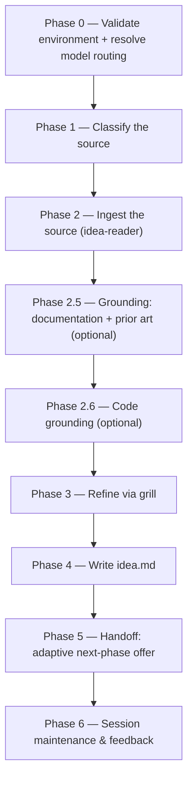

# idea:

Refines one raw source — a prompt, a file, a community post, or an exported Jira ticket — into a lean `idea.md` brief that seeds the future [`create-vi:`](create-vi.md).

## Who runs it

`idea:` runs in the [PM](../roles.md#pm-product-management) role. This edition records no cost attribution, so there is no phase or role label on the run's output — see [Roles](../roles.md) for what PM owns and hands off at the seam.

## Synopsis

    idea: [<VI-KEY>] <source> [--deep] [--ground-code [<repo>,…]] [--no-docs] [--no-prior-art] [--skip-feedback] [--enforce-model=<model>]

[Run flags](../reference/run-flags.md): both of this edition's run flags apply. Each has an environment default (`$WORKFLOWS_SKIP_FEEDBACK`, `$WORKFLOWS_ENFORCE_MODEL`) that an explicit flag overrides. `--skip-costs` is a Claude-edition flag only — this edition has no cost subsystem, so it is not parsed here at all.

**The VI comes first.** When the first token matches the Jira-key pattern and more tokens follow, it is the Value Increment the idea is for — it lands as `vi_key` in the `idea.md` frontmatter — and everything after it is the source. A key anywhere later is part of the source: a prompt ending "see how we did it in PRODUCT-2345" names no target. When the first token is a key and the only token, it is the source itself: an existing VI is its own target, and a feedback ticket has none yet. The grammar, by example:

| You type | Meaning | `idea.md` goes to |
|---|---|---|
| `idea: PRODUCT-12345 <long prompt>` | an idea for that VI, from a prompt | `PRODUCT-12345…/` |
| `idea: PRODUCT-12345 @notes/thing.md` | the same, from a file | `PRODUCT-12345…/` |
| `idea: PRODFB-929` | customer feedback, no VI yet | `PRODFB-929…/` |
| `idea: PRODUCT-17753 PRODFB-929` | feedback, VI known | `PRODFB-929…/`, with `vi_key: PRODUCT-17753` |
| `idea: PRODUCT-12345` | rewrite of an existing VI | `PRODUCT-12345…/` |
| `idea: PRODUCT-NEW PRODUCT-OLD` | a new VI extending or paralleling an old one | `PRODUCT-NEW…/` |
| `idea: <prompt>` (no key) | stops and asks for the VI key | — |

The source after the optional VI key is classified into one of three forms (Phase 1), by precedence:

- **An imported Jira ticket** — a key matching `^[A-Z][A-Z0-9_]*-\d+$`, resolved via `resolve-export-for-key` and then typed from the import's own `issue_type` frontmatter, never from the project prefix: `ValueIncrement` reads as an existing VI (prior art the user supplied), `Product Need` or `Account` reads as product feedback (a PRODFB ticket carries either), and any other `issue_type` is named to the user, who chooses, defaulting to VI. A key with no import anywhere stops the run with the SPECS-mode import command (`SPECS_PATH="$SPECS_PATH" python src/main.py <KEY>`, run in a `jira-workitem-import` checkout; its stock `runme.sh` unsets `SPECS_PATH`) and offers to check again.
- **A markdown file** — an existing `.md` path (a leading `@` is dropped), including a community post (tagged `community-post`) or a previously-written `idea.md` handed back for re-refinement.
- **An inline prompt** — anything else; the argument text itself becomes the raw idea. A prompt or file with no VI key in front stops and asks for one.

**Three safeguards** run before any folder is written. A first key whose import is not a `ValueIncrement` is not a target: when the source is a key whose import *is* a `ValueIncrement` — the old order, `idea: PRODFB-929 PRODUCT-17753` — the run says so in one line and swaps them; otherwise it asks you to re-enter the VI key or cancel. A VI key with no feature folder (a typo, a VI just created in Jira, or one seen only inside another ticket's import) is confirmed before a folder is created for it. Separately, a key matching several folders asks which one, recommending the folder that holds the key's import.

Four flags: `--deep` switches the grill from bounded (≤10 questions) to relentless (runs to convergence, no cap); `--ground-code [<repo>[,<repo>…]]` turns on the optional Phase 2.6 code-grounding scan — bare, the repo set is derived from mounted directories and the idea's themes; given a value, it scans exactly the named repos (the token after the flag counts as a repo list only when it has no whitespace and every comma-separated part matches a mounted top-level directory basename — otherwise the flag is bare and the token is idea text); `--no-docs` turns off documentation grounding; `--no-prior-art` turns off prior-art discovery.

## How it runs

```mermaid
flowchart TD
    p0["Phase 0 — Validate environment + resolve model routing"] --> p1["Phase 1 — Classify the source"]
    p1 --> p2["Phase 2 — Ingest the source (idea-reader)"]
    p2 --> p25["Phase 2.5 — Grounding: documentation + prior art (optional)"]
    p25 --> p26["Phase 2.6 — Code grounding (optional)"]
    p26 --> p3["Phase 3 — Refine via grill"]
    p3 --> p4["Phase 4 — Write idea.md"]
    p4 --> p5["Phase 5 — Handoff: adaptive next-phase offer"]
    p5 --> p6["Phase 6 — Session maintenance & feedback"]
```

`idea/SKILL.md` dispatches three subagents directly: `idea-reader` (Phase 2, ingests the source), `code-scanner` (Phase 2.6, one instance per confirmed repo, batches of up to 4 concurrent, only when `--ground-code` is given, with a seeded round 2 for any theme round 1 left inconclusive), and `impl-maintenance` (Phase 6, session lessons-learned). All three run at the caller's `detection_model`; the interactive grill and the authoring itself run inline on the session's own `current_model` rather than through a delegated subagent. Phase 2.5's grounding also reaches two more agents — `docs-grounder` and `prior-art-finder` — but indirectly, through the `dispatch-docs-grounder` and `dispatch-prior-art-finder` procedures in [`skills/_shared/docs-grounding.md`](../../skills/_shared/docs-grounding.md) and [`skills/_shared/prior-art.md`](../../skills/_shared/prior-art.md), rather than being named as a direct dispatch inside `idea/SKILL.md` itself.

## What it needs

- **`$SPECS_PATH`** — must be set, an existing directory holding one of `specs/`, `specifications/`, `vis/`, and writable before anything else runs (Phase 0). If any of that fails, the run stops and offers to enter the path, or cancel — it never falls back to the current working directory, which may be a code repository. `specs-preflight` also runs against it at the end of Phase 0, which can emit a guard notice and set `specs_git: blocked` for the whole run.
- **The idea source itself** — read by `idea-reader`. A Jira key with no import, or a path that does not exist, stops the run and offers to re-enter the source or cancel (for a key, to check again after importing it); this is an environment/user halt, not a plugin gap.
- **`$DOCS_PATH`** (optional, default `/workspace/docs`) — documentation grounding. Missing, unreadable, or carrying no markdown file is a silent, non-blocking skip: `docs grounding: OFF`, never an error. Turned off explicitly with `--no-docs`.
- **Prior art** (optional, on by default) — searches `$SPECS_PATH/specifications/**` for tracked initiatives this idea should be reconciled against, excluding the run's own folder from the hits. Turned off with `--no-prior-art`, or silently OFF when it cannot resolve (for example an invalid `$SPECS_PATH`); advisory only, never a gate.
- **`--ground-code` repo(s)** (optional) — only runs when the flag is given. A named repo that is not mounted is neither invented nor silently dropped — it is escalated and, if declined, carried forward by name with its themes left unverified. With no flag at all, the run does one cheap detection pass and prints at most one advisory line naming a repo the idea mentions; it never scans.

## What it produces

`idea.md`, authored against [`skills/_shared/idea-format.md`](../../skills/_shared/idea-format.md), written into its **origin's feature folder** under one of `$SPECS_PATH/{specs|specifications|vis}/` and never moved afterwards. The origin is the PRODFB feedback ticket's folder (`Product Need` or `Account`), or the VI's folder; the VI key, when one was given, is recorded as `vi_key` in the frontmatter. A VI with no folder yet gets one under `specifications/`, named `<VI-KEY>-<slug>`, after you confirm it. An existing `idea.md` there is refined or replaced on your say-so.

When the idea is `status: refined`, Phase 5 offers, behind a consent choice, to hand `idea.md` off onto the specs repo's default branch by branch, commit, push and pull request. A `status: draft` idea (any open `[NEEDS CLARIFICATION]`) is never handed off.

**There is no relocation.** [`create-vi:`](create-vi.md) finds the idea where `idea:` wrote it: by `--idea <KEY>`, by its own folder, by `vi_key`, or through the PRODFB tickets the VI's import links.

**Whichever way the consent choice goes, Phase 5 then recommends `create-vi:` with a merge clause** resolved from the handoff's outcome — *(once the pull request above is merged)* when it opened one, because [`create-vi:`](create-vi.md) stops on an `idea.md` whose pull request is still open. The form depends on where the idea sits:

- an idea in a VI folder → `create-vi: <VI-KEY>`;
- a PRODFB-folder idea with `vi_key` → `create-vi: <vi_key>`, which finds the idea by `vi_key`;
- a PRODFB-folder idea without one → `create-vi: <VI-KEY> --idea <PRODFB-KEY>`, after the VI is created in Jira; linking the VI to the PRODFB ticket in Jira (*is caused by*) lets `create-vi:` find the idea without the flag.

On a decline or a failed handoff it also offers `create-vi: <VI-KEY> @<path>`, which reads the file in place without waiting for it to reach the default branch.

## Gates

`idea:` has no reviewer agent — its bounded grill is the gate. By default the grill asks at most 10 questions across the ranked ambiguity gaps (problem clarity, target users, desired outcome, scope, evidence sufficiency, success signal, terminology) and then stops; any remaining high-impact gaps become `[NEEDS CLARIFICATION]` markers in `idea.md`, capped at 3, with reasonable defaults recorded as Assumptions instead. `--deep` removes the bound and runs the grill to convergence. A boundary the source states explicitly — *"not for ActiveGates"*, even in passing — is extracted by `idea-reader` into `stated_scope` and treated as a decision already made: it takes no question slot, no recommendation may argue from the scope it excludes, and it is written into `## Rough scope` unless you reverse it during the grill. A hedged one (*"maybe except…"*) is put to you to confirm. There is no style check and no structural pre-lint in this skill — both first appear in [`create-vi:`](create-vi.md). A `status: draft` `idea.md` (any open `[NEEDS CLARIFICATION]`) is never handed off, regardless of what else the run resolved.

## Example

    idea: PRODUCT-12345 "Add a dark-mode toggle to the settings page" --ground-code frontend

The run validates `$SPECS_PATH`, classifies the argument as a prompt, ingests it via `idea-reader`, grounds it against docs, prior art in the specs repo and the `frontend` repo, grills you (bounded, ≤10 questions) to fill the ambiguity gaps, and writes `idea.md` into the VI's feature folder. Phase 5 then offers the branch-and-pull-request handoff and recommends `create-vi: <VI-KEY>`. The same prompt without the leading `PRODUCT-12345` stops at Phase 1 and asks for the VI key.

## See also

- [Roles](../roles.md) — what the PM role owns and hands off at the seam with `create-vi:`.
- [Workflow overview](../workflow.md) — where `idea:` sits at the front of the pipeline.
- [`create-vi:`](create-vi.md) — the next skill; finds `idea.md` where `idea:` wrote it.
- [`idea-format.md`](../../skills/_shared/idea-format.md) — the canonical structure `idea.md` is authored against.
- [`prior-art.md`](../../skills/_shared/prior-art.md) and [`docs-grounding.md`](../../skills/_shared/docs-grounding.md) — the two optional grounding sources Phase 2.5 dispatches in parallel.
- [`model-routing.md`](../../skills/_shared/model-routing.md) — the classification and model-fallback rules Phase 0 applies.
