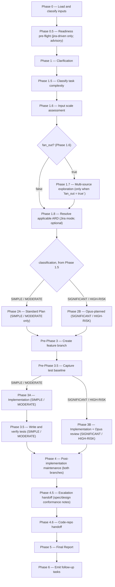

# implement:

Classifies task risk, creates a branch, plans and implements the change, writes tests, and — for risky work — runs an Opus code review before handing back a structured report.

## Who runs it

`implement:` runs in the [Dev](../roles.md#dev-build-verify-and-deliver) role. This edition records no cost attribution, so there is no phase or role label on the run's output — see [Roles](../roles.md) for what Dev owns and hands off at the seam.

## Synopsis

    implement: <prompt> [@path ...]

The argument mixes free-text prose with **zero or more `@path` tokens**; each is classified **by inspection, not by matching the path string** — a single `.md` file is a spec file, a directory holding `prompt.md` and/or a `*-design.md` is a spec folder, a directory holding a `*-index.md` (or ticket-key subdirectories) is a Jira ticket folder, and any git working tree (including the current one) is a code repo. The shared Jira-input front-end runs first and unifies this grammar with [`document:`](document.md)'s: a JiraID resolves under `$VAULT_PATH/jira-products/`, a directory that inspects as a Jira export becomes `jira_export_root`, a spec folder contributes to `specs`, and everything else is `direct` (free text / `@file` — this command's original flow). A jira-driven run implements **one Epic at a time**: an explicit `<VI> <Epic>` (or a bare nested Epic key) proceeds directly; a bare VI with exactly one Epic auto-selects it; a VI with ≥2 Epics renders a status-aware picker (Jira status maps to ○ / ◐ / ●, plus an explicit "Implement one broad VI-level slice instead" choice); a VI with 0 Epics offers [`epics:`](epics.md) first, or a broad VI-level slice.

## How it runs

`implement/SKILL.md` carries 17 `## Phase` headings — plus two `Pre-Phase` steps, `Pre-Phase 3 — Create feature branch` and `Pre-Phase 3.5 — Capture test baseline`, sitting between plan approval and coding; the diagram above includes them as their own nodes because two of this repo's Key invariants name them explicitly (a branch created before any file is touched; a test baseline captured before any source edit). It dispatches eight subagents directly: `jira-reader` and `code-scanner` (both Phase 1.7, one `code-scanner` per repo in a single response capped at 4 concurrent — only when `fan_out = true`), `risk-planner` (Phase 2B, SIGNIFICANT/HIGH-RISK only, caller-pinned to the strong reasoning tier — see [Gates](#gates)), `test-writer` (Phase 3.5 / Phase 3B step 4a, writing tests for the diff), `test-baseliner` (Pre-Phase 3.5's capture, then Phase 3.5 / 3B's verify), `code-review` (Phase 3B, SIGNIFICANT/HIGH-RISK only, caller-pinned to the strong reasoning tier — see [Gates](#gates)), `review-fixer` (Phase 3B's BLOCK / PASS WITH RECOMMENDATIONS fix cycle), and `impl-maintenance` (Phase 4, session lessons-learned). No indirect dispatch reaches a ninth agent. Phase 2A/2B's codebase exploration and Phase 4's documentation/knowledge-base/instructions maintenance sweep additionally spawn `general-purpose` agents — a Copilot CLI built-in agent type, not a `dev-workflows:` one, so they sit outside both counts.

## What it needs

- **The description** — a spec file, spec folder, Jira ticket folder, code repo, or free text, classified by inspection at Phase 0. A referenced `@dir` that's missing or unrecognized is surfaced immediately, never silently skipped.
- **A design-doc open-question guard** — when the primary description is a `design.md` (or `*-design.md`) carrying any unresolved `- [ ]` under its own `## Open questions` heading, the run refuses to proceed by default; overriding is logged in the Phase 5 report. A `specification.md`-level open question is exempt.
- **Specs for a jira-driven run** — when the front-end resolves `specs: []`, the run prompts to point at a specs directory or proceed unrecommended; a direct-prompt run (the prompt/spec file *is* the instruction) is exempt.
- **The in-scope `specification.md` / `design.md`** gated on `$SPECS_PATH`'s main via `require-on-main` — an unmerged one is a hard stop naming `$SPECS_PATH` explicitly (this run stands in a code repo, not the specs repo); an absent one is a silent no-op, since only an in-scope spec is gated at all.
- **A clean working tree** at Pre-Phase 3 — stash, proceed with the dirty state noted in the report, or cancel.
- **Multi-source input** (more than one code repo, or any Jira ticket folder / spec folder input) floors classification at SIGNIFICANT (overridable at plan approval) and triggers the Phase 1.7 fan-out scan, whose synthesized summary feeds `risk-planner` instead of the single Explore subagent.
- **An optional ARD** (Phase 1.8, jira-driven only), resolved via [`skills/_shared/ard-resolution.md`](../../skills/_shared/ard-resolution.md). `status: none` skips silently; `status: unmerged` stops, naming `$SPECS_PATH` explicitly; `status: found` carries the invariants forward as implementation guardrails, and — on the SIGNIFICANT/HIGH-RISK path — into `code-review` as `applicable_ard`.

## What it produces

Code changes on the feature branch created at Pre-Phase 3, **committed** to that branch at Phase 4.6 and — behind a single consent choice — pushed, with a pull request opened where the host allows one; the commit itself is not offered as a choice, because it is local and reversible and work that was never committed is the one loss no later step can undo. At least one test per new or changed behaviour, written by `test-writer` (a missing test framework is surfaced explicitly, never silently skipped); and a structured Phase 5 Final Report (classification, branch and its `Code repo:` handoff outcome, files changed, review verdict + triage, Spec/design conformance, the four maintenance-agent summaries, session learnings, and a next-step recommendation). On the SIGNIFICANT/HIGH-RISK path with a `specification.md`/`design.md` in scope, any unresolved `missing`/`contradicts` in-scope requirement from `code-review`'s Spec/design conformance dimension is escalated as a `- [ ]` note back onto `specification.md`/`design.md` under `## Engineering review`, offered for branch + commit + push + PR at Phase 4.5 behind the same [`phase-handoff.md`](../../skills/_shared/phase-handoff.md) consent choice every producer uses. Once every Epic under a VI is implemented, the run's own forward pointer recommends [`document:`](document.md) `<VI>` next, then `release-notes: <VI>` once documented — both VI-level, run once rather than per Epic.

## Gates

Phase 3B dispatches `code-review` — only on the SIGNIFICANT/HIGH-RISK path; SIMPLE/MODERATE runs have no Opus gate at all. Like every other Opus reviewer in this pipeline, it carries no `model:` pin of its own — the orchestrator pins the model at the dispatch call site (`task(model: <review_model>)`), resolved from the strong reasoning tier (Opus 5/4.8/4.7/4.6 or GPT-5.6/5.5) and recorded as `review_model`. It runs **after** implementation and **before** tests — a `BLOCK` verdict means tests do not run yet. Findings are triaged first ([`finding-triage.md`](../../skills/_shared/finding-triage.md)) before any `review-fixer` dispatch — the fixer sees survivors only. `BLOCK` invokes `review-fixer` for BLOCKER/MAJOR findings, then one re-review passing the fixer's report back as `claims_file`; an unresolved BLOCKER after that cycle is escalated individually. `PASS WITH RECOMMENDATIONS` invokes `review-fixer` for MAJOR findings only; MINOR/NIT findings are deferred. `PASS` proceeds. Cap: one fix cycle plus one re-review.

Planning gates too: `risk-planner` (Phase 2B, same strong-reasoning pin) is mandatory for SIGNIFICANT/HIGH-RISK work, and can itself return a `### Re-classification` down to SIMPLE/MODERATE — the user confirms before falling back to Phase 2A. For a bug-shaped task, `risk-planner` must back its ranked hypotheses with a repro it **actually ran**, or explicitly return `Ranking withheld — no red-capable repro`; proceeding on a guess is never the silent default. On the SIMPLE/MODERATE path there is no `risk-planner` and no `code-review` — Phase 3.5's fix loop applies fixes via the session model directly, capped at 2 attempts before surfacing remaining regressions to the user.

A run that ends on a failed gate — a review still `BLOCK` after its one fix cycle, or regressions you chose to keep — is still committed, and still offered for push and PR under the same consent choice — the failed gate never downgrades what you are offered. What changes is the pull request itself: it is opened as a draft whose body leads with a DO-NOT-MERGE line naming the blocking fact. Unreviewed work that exists can be reviewed later; work that was never committed cannot (`../../skills/_shared/code-repo-handoff.md` §2.9).

## Example

Implement a scoped change with no Jira ticket involved:

    implement: Add a --dry-run flag to the export CLI that prints the plan without writing files

The run classifies the input (free text, no `@path`), asks any clarifying questions, classifies task complexity (say MODERATE), explores the codebase, produces a standard plan, creates a feature branch, captures a test baseline, implements the change, writes and verifies tests against the baseline, then runs the four Phase 4 maintenance agents in parallel before the Final Report. With no Jira context there is no `### Next step` or `### Context hygiene` block.

## See also

- [Roles](../roles.md) — the Dev role; `implement:`'s in-scope specification-and-design gate mirrors [`specify:`](specify.md)'s and [`create-ard:`](create-ard.md)'s "absent falls back, unmerged stops" pattern.
- [`design:`](design.md) — the upstream skill whose merged `design.md` `implement:` plans and builds from, when jira-driven.
- [`ready:`](ready.md) — the optional Phase 0.5 pre-flight advisory that recommends running `ready:` first when the declared Jira status is below the readiness bar.
- [`model-routing.md`](../../skills/_shared/model-routing.md) — the classification rules, the multi-source SIGNIFICANT floor (§8), and the `risk-planner` / `code-review` strong-reasoning pins.
- [`bug-diagnosis.md`](../../skills/_shared/bug-diagnosis.md) — the repro-first discipline `risk-planner` follows on a bug-shaped task.
- [`finding-triage.md`](../../skills/_shared/finding-triage.md) — how `code-review`'s findings are triaged before `review-fixer` sees them.
- [`ard-resolution.md`](../../skills/_shared/ard-resolution.md) — how the optional ARD is resolved and carried forward as implementation guardrails.
