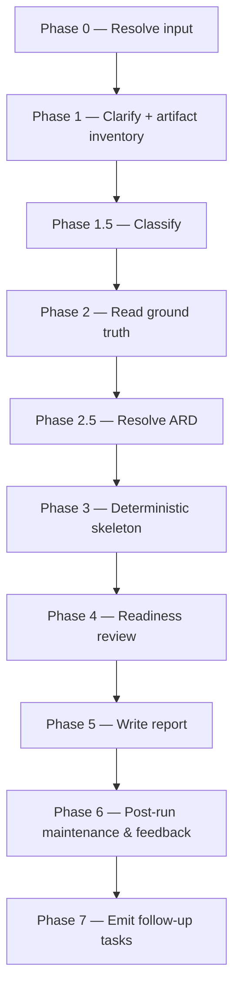

# ready:

Reads the declared Jira workflow status for a VI or Epic and checks whether the ARD, spec, and design artifacts that actually exist justify it, returning SUPPORTED / PARTIAL / NOT-SUPPORTED — without ever setting that status itself.

## Who runs it

`ready:` runs in the [Dev](../roles.md#dev-build-verify-and-deliver) role. This edition records no cost attribution, so there is no phase or role label on the run's output — see [Roles](../roles.md) for what Dev owns and hands off at the seam.

## Synopsis

    ready: <VI-Key | dir> [<Epic-Key>]

`ready:` is jira-driven only — a `mode: direct` prompt stops with `READY_NEEDS_JIRA`. `<VI>` alone checks **VI-level** readiness against [`workflow-states.md`](../../skills/_shared/workflow-states.md)'s VI ladder: a `null` focus Epic is a first-class check here, not something that must be resolved down to a single Epic the way [`design:`](design.md)'s picker requires. An explicit `<VI> <Epic>` scopes the check to that Epic's ladder instead.

## How it runs

`ready/SKILL.md` carries 10 `## Phase` headings and dispatches three subagents directly: `jira-reader` (Phase 2, `depth: vi-plus-epics` — the authoritative status source the reviewer verifies against, never Phase 1's own status peek), `readiness-reviewer` (Phase 4, caller-pinned to the strong reasoning tier — see [Gates](#gates)), and `impl-maintenance` (Phase 6, session lessons-learned). No indirect dispatch reaches a fourth agent here — unlike [`design:`](design.md), [`specify:`](specify.md), and [`create-ard:`](create-ard.md), `ready:` never dispatches `code-scanner`: its Phase 3(c) repo check is presence-only, a slug→clone match under `$REPOS_PATH`, never a scan. Phase 6 also spawns `general-purpose` agents (documentation/knowledge-base/instructions maintenance) — a Copilot CLI built-in agent type, not a `dev-workflows:` one, so it sits outside the count above.

## What it needs

- **A Jira VI (or VI + Epic)** via the shared front-end — a `mode: direct` prompt is rejected outright (`READY_NEEDS_JIRA`); `ready:` has no direct-prompt behavior.
- **`$SPECS_PATH`** (required) — `ready:` reads the ARD, spec, and design artifacts and writes `_readiness.md` under `$SPECS_PATH/specifications/`; unset stops the run naming `SPECS_PATH`.
- **A clean specs-repo main** — Phase 0 step 3 checks the branch and porcelain status; a non-main or dirty checkout is warned and confirmed before proceeding, never silently read as ground truth.
- **Every gated artifact the pipeline produces** (VI, ARD, `specification.md`, `design.md`) — `ready:` is the **one caller that never stops** on any of their `require-on-main` outcomes: an artifact off the default branch becomes a readiness finding that caps the eventual verdict at `PARTIAL`, and a missing one is simply recorded as a coverage gap. [Roles](../roles.md)' "The handover model" section names this as `ready:`'s defining trait.
- **An optional ARD**, resolved via [`skills/_shared/ard-resolution.md`](../../skills/_shared/ard-resolution.md). `status: none` makes the whole ARD dimension inactive (no-regression, skipped entirely); `status: found` and `status: unmerged` both carry the invariants forward as `applicable_ard` — `unmerged` additionally records "authored, not handed off" as a finding.

## What it produces

`_readiness.md`, **overwritten every run**, at the VI dir or Epic subdir: a header stamping the run timestamp and specs-repo git rev, the checked Jira status(es) exactly as read, the verdict, a coverage roll-up (N/M requirements covered, each ❌ gap named), the full `readiness-reviewer` Findings section, and the repo-availability result. It's committed and handed off only behind [`phase-handoff.md`](../../skills/_shared/phase-handoff.md) §4.3's consent choice (creating `ready/<KEY>-<slug>`) — declining leaves it uncommitted, and the terminal `commit-artifacts` step never stages `_readiness.md` itself, only `$SPECS_PATH`'s bounded session-artifact paths. `ready:` never writes to Jira, `jira-products/`, or the vault, and never sets the status it checks.

## Gates

Phase 4 dispatches `readiness-reviewer`. Like every other Opus reviewer in this pipeline, it carries no `model:` pin of its own — the orchestrator pins the model at the dispatch call site (`task(model: <review_model>)`), resolved from the strong reasoning tier (Opus 5/4.8/4.7/4.6 or GPT-5.6/5.5) and recorded as `review_model`. It reads the Phase 3 skeleton (a coverage map, a status-expectation checklist against [`workflow-states.md`](../../skills/_shared/workflow-states.md), and the repo-availability check) plus every artifact end-to-end itself, and returns SUPPORTED / PARTIAL / NOT-SUPPORTED — it never modifies files and never re-derives the declared status. Unlike every other reviewer in this pipeline there is no fix cycle here: `readiness-reviewer`'s verdict *is* the report, written into `_readiness.md` as returned — no `doc-fixer` or `review-fixer` dispatch, and no re-review.

## Example

Check whether a VI's declared status is actually justified before starting implementation:

    ready: PRODUCT-1234

The run resolves the VI, confirms the specs repo is on a clean main, builds the artifact inventory (ARD, spec, and design for every in-scope Epic) plus a Jira-status peek, classifies (typically MODERATE), reads the authoritative status via `jira-reader`, resolves any applicable ARD, builds the deterministic coverage map, status-expectation checklist, and repo-availability check, dispatches `readiness-reviewer`, and writes `_readiness.md`. It then offers to branch, commit, push, and open a pull request for the snapshot. A `SUPPORTED` verdict recommends [`implement:`](implement.md) `<VI>` next; `PARTIAL` / `NOT-SUPPORTED` names the gaps to resolve before re-running `ready:`.

## See also

- [Roles](../roles.md) — "The handover model" names `ready:` as the one caller allowed to keep going past a stop every other consumer treats as fatal.
- [`design:`](design.md), [`implement:`](implement.md), and [`document:`](document.md) — the three sibling Dev-role skills whose artifacts `ready:` verifies but never authors.
- [`create-ard:`](create-ard.md) — the optional upstream skill whose ARD `ready:` checks for conformance.
- [`model-routing.md`](../../skills/_shared/model-routing.md) — the classification rules and the `readiness-reviewer` strong-reasoning pin.
- [`workflow-states.md`](../../skills/_shared/workflow-states.md) — the VI/Epic status ladders and their "Expected artifacts" columns Phase 3(b) checks against.
- [`ard-resolution.md`](../../skills/_shared/ard-resolution.md) — how the optional ARD is resolved and carried into the reviewer's ARD-conformance dimension.
- [`phase-handoff.md`](../../skills/_shared/phase-handoff.md) — the `require-on-main` / `handoff-to-main` mechanics `ready:` reads from and writes `_readiness.md` through.
