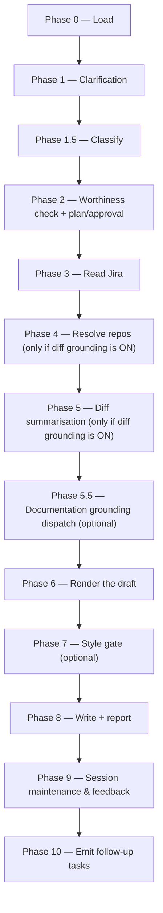

# release-notes:

Reads a Jira Value Increment (or any ticket) from exported markdown, optionally grounds the prose in merged PR diffs, and renders a customer-facing release-notes draft — shaped and routed by the destination it resolves to — for the user to paste into Jira's release-notes field.

## Who runs it

`release-notes:` is the one skill in this pipeline that straddles roles rather than sitting in one. [Roles](../roles.md) names it twice: under [PM](../roles.md#pm-product-management) as "the early run of `release-notes:`, before any specification or design exists yet," and again under [Dev](../roles.md#dev-build-verify-and-deliver) as "the final run of `release-notes:`, once a specification or design already exists." `release-notes/SKILL.md`'s own Phase 6 decides which: it globs the VI's specs feature folder for `specification.md` and `design.md` — **neither present** resolves `run_phase: pm` (the feature isn't built yet, so the draft carries no documentation link); **either present** resolves `run_phase: dev` (the author may supply a redirect link to the page [`document:`](document.md) will later publish). This edition records no cost attribution, so neither run carries a phase or role label on its output — the `run_phase` value only decides the draft's documentation-link behaviour, never a printed cost label.

## Synopsis

    release-notes: <JIRA-KEY | @jira-export-dir> [<focus-Epic-KEY>]

The argument is resolved by the shared Jira-input front-end ([`skills/_shared/jira-input-resolution.md`](../../skills/_shared/jira-input-resolution.md)), executed inline at Phase 0. `release-notes:` is **jira-driven only** — it has no direct-prompt behaviour, so a `mode: direct` result (no Jira input at all) stops the run with `RELEASE_NOTES_NEEDS_JIRA`. A resolved VI selector plus an optional focus-Epic key scopes Phase 6's rendered input to that Epic's subtree, without mutating the stored `jira-reader` handoff other phases read.

## How it runs

`release-notes/SKILL.md` dispatches four subagents directly: `jira-reader` (Phase 3), `diff-summarizer` (Phase 5, one instance per resolved repo in batches of up to 4 concurrent — only when the user turns diff grounding ON at Phase 1, default OFF), `release-notes-writer` (Phase 6, renders the draft and, on a low-confidence Change Type, returns a `gaps[]` entry the orchestrator resolves by consequence, never by enum label), and `impl-maintenance` (Phase 9, session lessons-learned, pinned to the detection chain since this skill has no maintenance agent of its own). `diff-summarizer` is named only in prose ("Spawn `diff-summarizer` in batches…") rather than through a `task(agent_type: "dev-workflows:diff-summarizer", …)` block shown inline — it is still a direct, in-file dispatch, not an indirection through a `skills/_shared/` procedure. Phase 5.5's documentation grounding reaches a fifth agent, `docs-grounder`, but indirectly, through the `dispatch-docs-grounder` procedure in [`skills/_shared/docs-grounding.md`](../../skills/_shared/docs-grounding.md), consuming the consent already resolved at Phase 2 rather than re-running it. Phase 7's optional style gate reaches `dt-style-guide:dt-style-checker` and `dt-style-guide:dt-doc-fixer` — a different plugin's namespace entirely, skipped gracefully when `dt-style-guide` is not installed, so it sits outside both counts.

## What it needs

- **A Jira VI or ticket**, resolved via the shared front-end — a JiraID under `$VAULT_PATH/jira-products/`, or an explicit jira-export directory. No `$VAULT_PATH` at all with no directory token is a hard stop naming the required forms.
- **`relevant_for_release_notes`**, read directly from the imported VI frontmatter (never from an authored specs draft) at Phase 2's worthiness gate: an explicit `false`/`no` stops the run with `RELEASE_NOTES_NOT_RELEVANT` (overridable, drafting anyway); absent defaults to proceed silently.
- **Diff grounding** (optional, default OFF — "Jira content is usually enough for release notes"). Turned on at Phase 1, it needs `$REPOS_PATH` (default `/workspace`, may be a colon-separated list) and a PR-status filter (MERGED only by default); Phase 4 resolves each PR's repo slug against a `git remote get-url origin` map of mounted clones, escalating on zero matches.
- **Documentation grounding** (optional, on by default when `$DOCS_PATH` resolves), resolved once at Phase 2 as the run's only consent-bearing step and consumed later at Phase 5.5; turned off with `--no-docs`.
- **An output destination** — always a file (console-pasted markdown loses Jira formatting); the default resolves to the ticket's persistent Obsidian project folder under `$VAULT_PATH/Projects`, never `jira-products/` (which is regenerated on every import) and never inside a docs repo.
- **`imported_change_type`** and **`imported_release_notes_category`**, both Jira-mirror fields read from the `jira-reader` handoff, never from an authored VI (`skills/_shared/vi-format.md` never carries them). A low-confidence inferred Change Type triggers a Phase 6 confirmation by consequence — draft shape and destination file — never by presenting the bare Jira enum label.

## What it produces

Exactly one Summary, rendered against [`skills/_shared/release-note-types.md`](../../skills/_shared/release-note-types.md) — a `{{#context}}` label (sourced verbatim from `imported_release_notes_category`, omitted when absent) plus an `### title` and prose for the `feature-updates` / `breaking-changes` destinations, or one bare past-tense sentence for `fixes` — with **no** Jira IDs, **no** PR links, and **no** `{{#internal-note}}` block (the docs automation adds that wrapper on import). A deprecating change carries a deprecation note (end-of-life date required, end-of-support optional); a missing required date becomes a `deprecation_eol` gap the run asks about rather than invents. The draft is written to the resolved persistent file for the user to paste into the ticket's Jira release-notes field — `release-notes:` never writes into a docs repo and never commits the draft itself; the terminal `commit-artifacts` step (Phase 10) commits only `$SPECS_PATH`'s bounded session-artifact paths.

## Gates

No Opus review and no branch — `release-notes:` is a **light gate only**. Phase 7's optional style check runs `dt-style-guide:dt-style-checker` on the rendered draft when the user opts in and the `dt-style-guide` plugin is installed (skipped gracefully, noted in the report, when it isn't); safe fixes are applied by `dt-style-guide:dt-doc-fixer` on request, with no re-review cycle. When `release-notes-writer` returns `gaps[]` entries carrying `jira_phrasing` and `source_phrasing` (a Jira-vs-source discrepancy), Phase 6 walks the same per-claim discrepancy prompt [`document:`](document.md) (Jira mode) Phase 5.8 uses — decide per discrepancy, document all as code, document all as Jira, or skip and report (drafting a `<KEY>-implementation-gaps.md` bug report). The only two hard checkpoints across the whole run are the specs-repo git guards — `specs-preflight` at Phase 0, `commit-artifacts` at Phase 10.

## Example

    release-notes: PRODUCT-4821

The run resolves the VI under `$VAULT_PATH/jira-products/PRODUCT-4821`, confirms Jira content only (diff grounding stays off by default), reads the handoff via `jira-reader`, finds no `specification.md`/`design.md` yet under the VI's specs folder (so `run_phase: pm`), renders a `feature-updates.md`-shaped draft from the inferred Change Type, writes it to the ticket's Obsidian project folder, and reports the destination alongside a `### Next step` pointing at whichever PA/PE phase is still pending for this VI.

## See also

- [Roles](../roles.md) — the PM/Dev split this skill's own `run_phase` resolution decides per run.
- [`document:`](document.md) — the VI-level documentation run that a `run_phase: dev` draft's optional link points at; shares its Phase 5.8 discrepancy-prompt shape.
- [`create-vi:`](create-vi.md) — the PM skill whose "recommended clear next step" is the early `release-notes:` run.
- [`release-note-types.md`](../../skills/_shared/release-note-types.md) — the destination map, per-destination draft shape, and Change Type sourcing this skill cites but never re-derives.
- [`docs-grounding.md`](../../skills/_shared/docs-grounding.md) — the `dispatch-docs-grounder` indirection Phase 5.5 consumes.
- [`jira-input-resolution.md`](../../skills/_shared/jira-input-resolution.md) — the shared front-end this skill's Synopsis argument resolves through.
- [`model-routing.md`](../../skills/_shared/model-routing.md) — the classification rules Phase 1.5 applies (MODERATE, no Opus gate).
