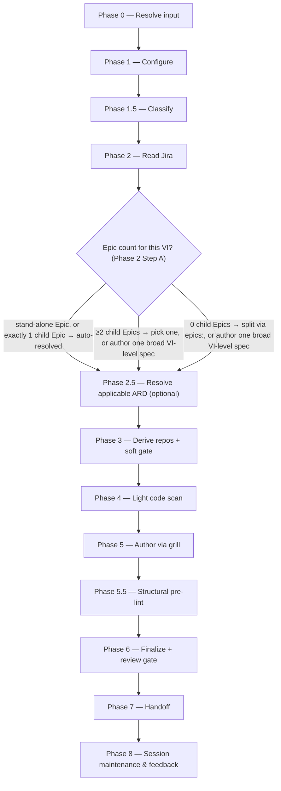

# specify:

Reads a Jira Epic or VI from exported markdown, lightly grounds in code, and authors an org-standard `specification.md` through a relentless one-question-at-a-time grill.

## Who runs it

`specify:` runs in the [PE](../roles.md#pe-product-engineering) role. This edition records no cost attribution, so there is no phase or role label on the run's output — see [Roles](../roles.md) for what PE owns and hands off at the seam.

## Synopsis

    specify: <VI-Key | Epic-Key | dir> [<Epic-Key>] [--no-docs]

Key distinction from [`epics:`](epics.md): `epics:` *splits* a VI into Epic drafts; `specify:` *authors one specification* for a single item. The VI-level path is genuinely valid, not a fallback of last resort: `specify: <VI>` with no focus Epic stays in the PE lane and produces one broad `specification.md` at the VI dir. What Phase 2 Step A does with a bare VI key depends on how many child Epics it has:

- **A stand-alone top-level Epic** (no parent VI) — no picker; the item is itself the focus.
- **A VI with exactly 1 Epic** — no picker; that Epic auto-resolves as the focus, with a one-line notice.
- **A VI with ≥2 Epics** — Phase 2 Step A renders a progress-aware picker: one row per child Epic (marked ○ not started / ◐ in progress / ● done), plus an explicit "Author one broad VI-level spec instead" choice.
- **A VI with 0 Epics** — offered a choice to split into Epics first with `epics:`, or author one broad VI-level spec now; `specify:` never creates Jira Epics itself.

An explicit `<VI-Key> <Epic-Key>` (or `<dir> <Epic-Key>`) skips the picker entirely — the Epic is already chosen. `--no-docs` turns off the optional documentation-grounding pass dispatched between Phase 4 and Phase 5.

## How it runs

`specify/SKILL.md` dispatches four subagents directly: `jira-reader` (Phase 2, twice on a multi-Epic VI — a cheap `vi-plus-epics` read for Step A's picker, then a `depth: full` read scoped to the resolved Epic), `code-scanner` (Phase 4, one instance per mounted candidate repo, up to 4 concurrent per batch — deliberately light relative to `epics:`'s scan, grounding for feasibility rather than a full reuse audit), `spec-reviewer` (Phase 6, caller-pinned to the strong reasoning tier — see [Gates](#gates)), and `impl-maintenance` (Phase 8, session lessons-learned). Documentation grounding — dispatched between Phase 4 and Phase 5, with no phase number of its own — also reaches a fifth agent, `docs-grounder`, but indirectly, through the `dispatch-docs-grounder` procedure in [`skills/_shared/docs-grounding.md`](../../skills/_shared/docs-grounding.md), rather than being named as a direct dispatch inside `specify/SKILL.md` itself. The grill and the `specification.md` authoring itself run inline on `current_model` rather than through a delegated subagent.

## What it needs

- **A Jira Epic or VI** via the shared front-end — a `mode: direct` prompt is rejected outright (`SPECIFY_NEEDS_JIRA`); `specify:` has no non-Jira behavior.
- **The VI on the specs repo's default branch** — gated via `require-on-main` against `specifications/<VI>-<vslug>/`. An unmerged VI is a hard stop, naming the branch and any open pull request. An **absent** VI is not a stop: `specify:`'s existing Jira-export behaviour is unaffected, and the run reports that it is specifying from the export directly — the same fallback [`create-ard:`](create-ard.md) uses.
- **`$SPECS_PATH`** (required) — `specify:` writes under `$SPECS_PATH/specifications/`, the specs repo, never the vault; unset stops the run naming `SPECS_PATH`, with no vault-relative fallback.
- **An optional ARD** for this item (Phase 2.5), resolved via [`skills/_shared/ard-resolution.md`](../../skills/_shared/ard-resolution.md) with the VI and the resolved focus Epic. `status: none` skips silently; `status: unmerged` stops, naming the branch and any pull request; `status: found` keeps the spec's user stories and scope consistent with its `[AD#N]` invariants during the grill, passed to `spec-reviewer` as `applicable_ard`.
- **Mounted repos under `$REPOS_PATH`** — candidates are auto-derived from Jira capability themes and linked PR URLs. An unresolved repo slug (zero or ambiguous matches) hard-escalates before Phase 4 runs at all. A resolved-but-unmounted repo, by contrast, only **soft-gates**: it becomes an open question in `_session.md` and the run proceeds with the remaining mounted repos — the specification just can't cite the ungrounded one until it's mounted and the run is re-invoked.
- **`$DOCS_PATH`** (optional, default `/workspace/docs`) — consumed with grill-rank ranking ahead of Phase 5. Missing, unreadable, or empty is a silent, non-blocking skip. Turned off with `--no-docs`.
- **A prior `_session.md`** (optional) — if one exists in the resolved feature folder, Phase 1 offers resume-vs-fresh; on resume, Phase 5 begins at the first unsettled stage instead of the header.

## What it produces

`specification.md` (`Published: no`), `idea.md` (pre-spec brainstorming provenance derived from the scoped Jira text), `_session.md`, `_glossary.md`, and a rendered `.html` mirror — written into the feature folder: the Epic subfolder for a per-Epic or stand-alone-Epic spec, or the VI dir itself for a broad VI-level spec. `specification.md` is authored against [`skills/_shared/specification-format.md`](../../skills/_shared/specification-format.md) through five ordered stages — Problem statement, Scope, User stories (`[Uxx]`), Acceptance criteria (`[ACxx]`, EARS phrasing), and Test cases (`[TCxx]`) — a numbered-ID scheme deliberately separate from a VI's `[US#N]`-style grammar. Behind Phase 7's consent choice, the whole feature folder is committed, pushed, and a pull request opened against the specs repo's default branch — merged-to-main is what makes the spec visible to Devs and to `design:`, which reads it from the default branch only, never from a branch. `Published: yes` is a separate, human-only freeze step outside this skill's scope.

## Gates

Phase 6 dispatches `spec-reviewer`. Like `ard-reviewer` and `epic-reviewer`, this agent carries no `model:` pin of its own — the orchestrator pins the model at the dispatch call site (`task(model: <review_model>)`), resolved from the strong reasoning tier (Opus 5/4.8/4.7/4.6 or GPT-5.6/5.5) and recorded as `review_model`. It checks per-stage quality, cross-stage consistency, coverage, and identifier integrity. `BLOCK` fixes the BLOCKER findings inline — the orchestrator/grill edits `specification.md` directly; there is no delegated writer to re-dispatch — and re-reviews once; an unresolved BLOCKER after that cycle is escalated individually, with "Defer" appending a `## Refinement notes` section to the spec itself. `MAJOR`/`MINOR`/`NIT` findings under `PASS WITH RECOMMENDATIONS` are deferred to the final report with no mandatory fix cycle. Cap: one fix cycle plus one re-review.

Ahead of the review, Phase 5.5 runs a structural pre-lint ([`skills/_shared/pre-lint.md`](../../skills/_shared/pre-lint.md)) — advisory only — checking the Universal checks and the spec block, including that the header's `Open questions` count matches the actual `- [ ]` count.

## Example

Author a specification for a single Epic already selected:

    specify: PRODUCT-1234 EPIC-98761

The run resolves the VI and the named focus Epic (skipping the picker, since it was given explicitly), reads the full Epic subtree, resolves any applicable ARD, derives and lightly scans mounted repos, grills you relentlessly through Problem statement → Scope → User stories → Acceptance criteria → Test cases, runs the structural pre-lint, then `spec-reviewer`. On a passing verdict it offers to branch, commit, push, and open a pull request; if this Epic came from a multi-Epic VI's picker, it then offers to loop straight into the next sibling Epic.

## See also

- [Roles](../roles.md) — what the PE role owns, including the two "absent falls back, unmerged stops" gates it shares with [`create-ard:`](create-ard.md).
- [`epics:`](epics.md) — the upstream skill that splits a VI into the child Epics `specify:` is typically run once per; a VI with 0 Epics is offered a link back here.
- [`create-ard:`](create-ard.md) — the optional upstream skill whose `[AD#N]` invariants `specify:` inherits when present.
- `design:` — the downstream skill that refuses to start until this skill's `specification.md` is merged to the specs repo's default branch.
- [`model-routing.md`](../../skills/_shared/model-routing.md) — the classification rules and the `spec-reviewer` strong-reasoning pin.
- [`specification-format.md`](../../skills/_shared/specification-format.md) — the canonical structure `specification.md` is authored and reviewed against.
- [`ard-resolution.md`](../../skills/_shared/ard-resolution.md) — how the optional ARD is resolved and inherited.
