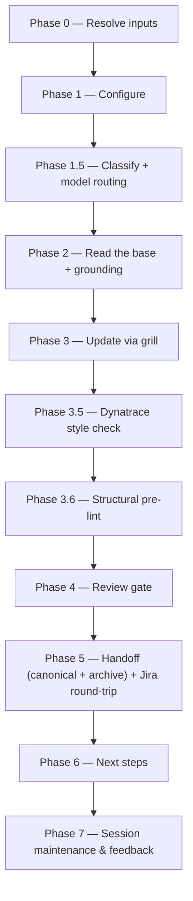

# update-vi:

Refreshes an existing Value Increment against its Jira source — routine updates and the rarer obstacle-driven re-do alike — gated by the same reviewer as [`create-vi:`](create-vi.md).

## Who runs it

`update-vi:` runs in the [PM](../roles.md#pm-product-management) role. This edition records no cost attribution, so there is no phase or role label on the run's output — see [Roles](../roles.md) for what PM owns and hands off at the seam. `update-vi:` is deliberately the one PM skill that never calls `require-on-main` at all (see [What it needs](#what-it-needs)).

## Synopsis

    update-vi: <KEY> [@transcript-or-notes ...] [--no-docs]

- **`<KEY>`** (mandatory) — the existing VI's Jira key. Format-validated only (`^[A-Z][A-Z0-9_]*-\d+$`).
- **`[@transcript-or-notes ...]`** (optional) — one or more paths to a transcript or notes file, read as secondary, read-only grounding for the grill.
- **`[--no-docs]`** — turns off documentation grounding for the run (see [What it needs](#what-it-needs)).

## How it runs

`update-vi/SKILL.md` dispatches two subagents directly: `vi-reviewer` (Phase 4, caller-pinned to the strong reasoning tier — see [Gates](#gates)) and `impl-maintenance` (Phase 7, session lessons-learned). Phase 2's documentation grounding also reaches `docs-grounder`, but indirectly, through the `dispatch-docs-grounder` procedure in [`skills/_shared/docs-grounding.md`](../../skills/_shared/docs-grounding.md), rather than being named as a direct dispatch inside `update-vi/SKILL.md` itself. A further agent, `dt-style-guide:dt-style-checker`, runs in Phase 3.5 exactly as it does in [`create-vi:`](create-vi.md) — a non-gating quality pass from a separate plugin, not counted above.

## What it needs

- **`<KEY>`** — mandatory; absent or malformed stops the run with `UPDATE_VI_NEEDS_KEY`.
- **`$SPECS_PATH`** (required) — if unset, the run stops naming `SPECS_PATH` and offers to enter a path or cancel.
- **The re-imported Jira VI**, at `$VAULT_PATH/jira-products/<KEY>` (body + `-comments.md`) — the run's **authoritative base**, resolved Jira-import-first. Not yet imported stops the run and asks you to import it first; imported but stale (older than 3 days) offers a re-import rather than stopping outright.
- **Secondary grounding** (all optional and read-only): a frozen specs-repo draft (`<KEY>_*.md`), any `*_ARD.md`, `specification.md`, and the `@transcript`/notes path(s) passed on the command line. None of these gate the run. Where a discovered `*_ARD.md` or `specification.md` is not on the specs repo's default branch, the Phase 1 confirmation flags it as unapproved — advisory only, never a reason to stop.
- **Documentation grounding** (optional, on by default) — turned off with `--no-docs`; a miss is a silent skip, never a gate.
- **No repos.** `update-vi:` is cwd-agnostic and product-level — it never mounts or scans code.

**`update-vi:` is the one authoring skill deliberately excluded from `require-on-main`.** It never executes that consumer entry point at all, on any input. Its authoritative base is the Jira import (above), not a gated specs artifact, so subjecting the secondary grounding to `require-on-main` would block a legitimate refresh purely because an unrelated ARD happened to sit on an unmerged branch — the skill reports that state instead of stopping on it.

## What it produces

- The **canonical** VI, overwritten in place at `<feature-folder>/<KEY>_<slug>.md`, with `revision_of` (the archived snapshot's path) and `built_from_import` (the Jira-import date the update was built from) added to its frontmatter.
- An **archived snapshot** of the prior canonical VI, written first, before the overwrite, to `<feature-folder>/revisions/<KEY>_<slug>_<YYYYMMDD>.md` (a same-day second revision is suffixed `-2`, `-3`, …).
- Behind Phase 5's consent choice, both files are committed, pushed, and a pull request opened against the specs repo's default branch.
- A **Jira round-trip reminder** (manual, not automated): paste the updated body back into the Jira workitem `<KEY>`, then re-import it to `$VAULT_PATH/jira-products/<KEY>` — skipping either step leaves the update diverged from Jira again.

## Gates

- **Phase 3.5 — Dynatrace style check**, mirroring [`create-vi:`](create-vi.md) exactly: `dt-style-guide:dt-style-checker` applies MAJOR fixes inline and re-runs once; a non-gating quality pass, skipped gracefully when the `dt-style-guide` plugin is not installed.
- **Phase 3.6 — Structural pre-lint** ([`skills/_shared/pre-lint.md`](../../skills/_shared/pre-lint.md)), advisory only — mechanical findings fixed inline, content gaps left for the grill.
- **Phase 4 — `vi-reviewer`.** As in [`create-vi:`](create-vi.md), this agent carries no `model:` pin of its own — the orchestrator pins the model at the dispatch call site (`task(model: <review_model>)`), resolved from the strong reasoning tier (Opus 5/4.8/4.7/4.6 or GPT-5.6/5.5) and recorded as `review_model`. It reviews the whole updated VI against [`skills/_shared/vi-format.md`](../../skills/_shared/vi-format.md). `PASS` / `PASS WITH RECOMMENDATIONS` proceeds. `BLOCK` triggers one inline fix cycle and one re-review; a persistent `BLOCK` is escalated per [`skills/_shared/escalation-rules.md`](../../skills/_shared/escalation-rules.md)'s "Review verdict BLOCK" choices, exactly as in [`create-vi:`](create-vi.md).

## Example

    update-vi: PRODUCT-1234 @call-notes.md

The run resolves the feature folder, pulls the current Jira-imported VI plus its comments as the authoritative base, reads the call notes as secondary grounding, confirms the scope of the update (refresh vs. re-do), grills you relentlessly while diffing against the base rather than starting from blank, runs the style check and pre-lint, then `vi-reviewer`. On a passing verdict it archives the prior VI, writes the refreshed canonical VI, offers to open a pull request, and reminds you to paste the update into Jira and re-import it.

## See also

- [Roles](../roles.md) — what the PM role owns and hands off at the seam.
- [`create-vi:`](create-vi.md) — the greenfield sibling that authors a VI from scratch; this skill's Phase 0 does not redirect to it — an unimported `<KEY>` stops and asks you to run the workitem importer first.
- [`create-ard:`](create-ard.md), [`specify:`](specify.md), and [`release-notes:`](release-notes.md) — the role re-runs Phase 6 offers when an ARD, spec, or release note already exists.
- [`model-routing.md`](../../skills/_shared/model-routing.md) — the classification and model-fallback chain `vi-reviewer` runs under.
- [`vi-format.md`](../../skills/_shared/vi-format.md) — the canonical structure the VI is updated and reviewed against.
- [`vi-source-resolution.md`](../../skills/_shared/vi-source-resolution.md) — the Jira-import-first resolution ladder Phase 0 executes.
