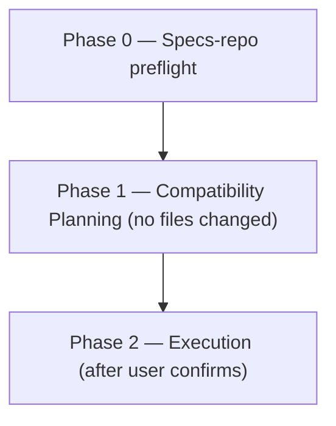

# upgrade:

Upgrades libraries, frameworks, runtimes, or build tools to a specified or latest version — planning each component in parallel, then executing them one at a time, gated by a strong-reasoning code review for SIGNIFICANT / HIGH-RISK components, and verified against a captured test baseline.

## Who runs it

`upgrade:` runs outside the PM → PA → PE → Dev pipeline. This edition records no cost attribution, so there is no phase or role label on the run's output at all — not even an inferred one. [`skills/_shared/next-phase-offer.md`](../../skills/_shared/next-phase-offer.md)'s own "Not pipeline nodes" section lists `upgrade:` alongside `vuln:`, `feedback:`, the `prompt:` family, `docs-profile:`, and the two guideline reviewers as skills that carry no next-phase offer. Run it against any repo, any time a component needs a version bump — it is tied to no VI, Epic, or other pipeline artifact.

## Synopsis

    upgrade: <component[:1.2.3|:minor|:latest|:lts]> [<component[...]> ...]

Each token is one component and an optional target: `component:1.2.3` (exact), `component:minor` (latest patch on the current minor), `component:latest` (latest stable), `component:lts` (latest LTS), or a bare `component` (latest version compatible with everything else already in the repo). `component` can be a library, a framework, a language runtime, a build tool, or a path such as `.github/workflows`. All changes are left **uncommitted** on the feature branch Phase 2 prep creates (`git checkout -b`, per `~/.copilot/installed-plugins/ihudak-copilot-plugins/dev-workflows/skills/_shared/branch-naming.md`) — this skill never commits the upgrade itself.

## How it runs

`upgrade/SKILL.md` carries three `## Phase` headings, shown above — Phase 2 internally splits into a one-time `### Phase 2 prep` (branch + baseline capture) and a `### Per-component loop`, both H3-level and folded into the single Phase 2 node since they aren't their own `## Phase` heading. It dispatches seven subagents directly, all real (`agents/*.md` exists for each): `upgrade-planner` (Phase 1, one per requested component, batched in a single agent message), `risk-planner` (Phase 1, SIGNIFICANT/HIGH-RISK components only, before execution begins), `test-baseliner` (Phase 2 prep, captured once and reused across the whole batch), `upgrade-executor` (Phase 2, per component, sequential), `code-review` (Phase 2, SIGNIFICANT/HIGH-RISK only, before tests run), `review-fixer` (Phase 2, for surviving BLOCKER/MAJOR findings after triage), and `impl-maintenance` (Phase 2, post-batch session lessons-learned). Only `upgrade-planner`, `risk-planner`, `test-baseliner`, and `upgrade-executor` appear as literal `task(agent_type: "dev-workflows:…")` calls in the file; `code-review`, `review-fixer`, and `impl-maintenance` are invoked by bare name in prose ("Invoke `code-review` using…", "invoke `review-fixer` with model: …", "invoke `impl-maintenance` with…") without repeating the `dev-workflows:` prefix — a citation-style inconsistency inside the file itself, not an indirection through a `skills/_shared/` procedure, so all seven are direct dispatches. No `dispatch-*`/`resolve-*` indirection appears anywhere in this skill.

## What it needs

- **At least one component token**, per the Synopsis grammar. Version resolution follows the table in the skill's own `## Version Resolution` section — an exact version is verified to exist and never silently downgraded on conflict; `lts` consults [`skills/_shared/upgrade/lts-sources.md`](../../skills/_shared/upgrade/lts-sources.md) and asks the user if that lookup fails.
- **An inventory pass** across build files, runtime version files, and CI YAML, per [`skills/_shared/upgrade/ecosystems.md`](../../skills/_shared/upgrade/ecosystems.md). For Java specifically, version declarations span build files, `.sdkmanrc`, `.java-version`, `.tool-versions`, Dockerfiles, and GitHub Actions workflow files — a single Java target updates all of them consistently, never just the build file.
- **A per-component classification**, resolved after planning (never skipped): "Patch or same-major minor bump" defaults `MODERATE`, "major bump or code changes required to adopt the new version" defaults `SIGNIFICANT`, and a major bump of a security-critical library or a change in auth/session/token/permission/payment/audit paths defaults `HIGH-RISK`. When in doubt, the run escalates upward.
- **A confirmed plan** — the resolved component list, classifications, related upgrades, and any strong-reasoning plans are presented before Phase 2 touches a single file.
- **A resolved plan-handoff file per component** — written to a temp path (never inside a repo tree) and passed by path, never pasted, to `risk-planner`, `upgrade-executor`, and every resume step. An unreadable path at any of those steps is a hard stop for that component (marked `BLOCKED` in the results table), never retried with a freshly re-derived planning pass.

## What it produces

Version-bump changes applied one component at a time, left **uncommitted** on the current feature branch (`upgrade-executor`'s output, per component) — the user reviews and commits them. An `## Upgrade Summary` table (`Component | Before | After | Class | Review | Status | Notes`) with a test-count line against the captured baseline, a `### Review triage` section naming every finding reviewed and every dismissal's reason for components that reached review, and the `impl-maintenance` lessons-learned report. This skill never commits the upgrade itself — the terminal `commit-artifacts` step commits only `$SPECS_PATH`'s bounded session-artifact paths, printed as a `Specs repo:` line.

## Gates

Phase 2's SIGNIFICANT/HIGH-RISK components dispatch `code-review` before any test run — a `BLOCK` verdict means tests do not run yet. Like every reviewer in this pipeline, `code-review` carries no `model:` pin in its own frontmatter (confirmed: zero of 34 `agents/*.md` files set one) — the orchestrator pins the model at the dispatch call site and records it as `review_model`, resolved from the strong reasoning tier (Opus 5/4.8/4.7/4.6 or GPT-5.6/5.5). `upgrade/SKILL.md`'s own `model_routing` comments describe `risk-planner` and `code-review` the same way: dispatch-pinned, never frontmatter-pinned. Findings are triaged first ([`finding-triage.md`](../../skills/_shared/finding-triage.md)) before any `review-fixer` dispatch: each finding is verified at the location it names, kept or dismissed with a reason, and the fixer sees survivors only. `BLOCK`/`PASS WITH RECOMMENDATIONS` invokes `review-fixer` for the surviving BLOCKER/MAJOR findings, then one re-review against a freshly refreshed diff; a still-`BLOCK` second verdict stops and escalates before any test runs. The SIMPLE/MODERATE path has no Opus gate at all. A `TEST_REGRESSION` result on either path is never auto-resolved: the orchestrator (this skill, in the interactive session — sub-agents cannot prompt) presents the failing tests and asks keep-and-leave-failing, revert, or investigate further. An incompatible pair of explicit versions (e.g. Gradle 9 with Java 11) is never silently resolved either — `upgrade-planner` stops with `CONFLICT` and ranked alternatives.

## Example

    upgrade: springboot:latest java:lts

The run inventories both components, plans each in parallel (`upgrade-planner`), classifies Spring Boot as `HIGH-RISK` and Java as `SIGNIFICANT` given the related upgrade, runs `risk-planner` for both before execution, confirms the plan, captures a test baseline once, executes Spring Boot first with an Opus/strong-reasoning review gate before tests, then Java, prints the summary table, and leaves both upgrades uncommitted on the current branch for review.

## See also

- [`vuln:`](vuln.md) — the sibling non-pipeline workflow for CVE remediation rather than planned version bumps; shares the same per-component classification, strong-reasoning review gate, and `test-baseliner`/`code-review`/`review-fixer` dispatch shape.
- [`finding-triage.md`](../../skills/_shared/finding-triage.md) — how `code-review`'s findings are triaged before `review-fixer` sees them.
- [`context-management.md`](../../skills/_shared/context-management.md) — the read-failure contract behind "never retry by re-deriving the artifact" on an unreadable `plan_file`/`claims_file`.
- [`branch-naming.md`](../../skills/_shared/branch-naming.md) — how the upgrade branch name is resolved.
- [`model-routing.md`](../../skills/_shared/model-routing.md) — the per-component classification heuristics and the strong-reasoning fallback chain.
