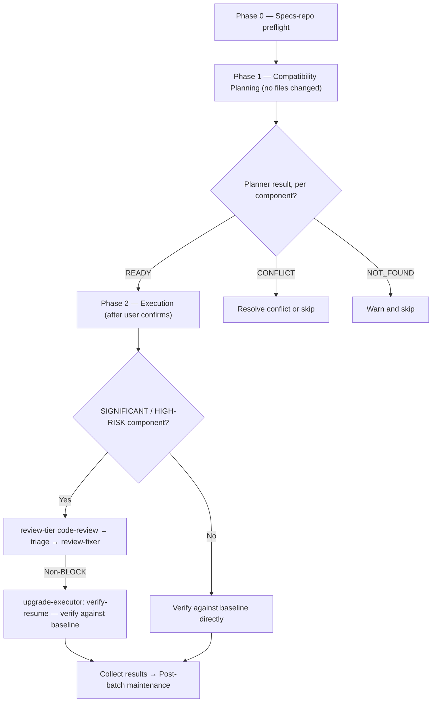

# upgrade:

Upgrades libraries, frameworks, runtimes, or build tools to a specified or latest version — planning each component in parallel, then executing them one at a time, gated by a strong-reasoning code review for SIGNIFICANT / HIGH-RISK components, and verified against a captured test baseline.

## Who runs it

`upgrade:` runs outside the PM → PA → PE → Dev pipeline. This edition records no cost attribution, so there is no phase or role label on the run's output at all — not even an inferred one. [`skills/_shared/next-phase-offer.md`](../../skills/_shared/next-phase-offer.md)'s own "Not pipeline nodes" section lists `upgrade:` alongside `vuln:`, `feedback:`, the `prompt:` family, `docs-profile:`, and the two guideline reviewers as skills that carry no next-phase offer. Run it against any repo, any time a component needs a version bump — it is tied to no VI, Epic, or other pipeline artifact.

## Synopsis

    upgrade: <component[:1.2.3|:minor|:latest|:lts]> [<component[...]> ...] [--skip-feedback] [--enforce-model=<model>]

[Run flags](../reference/run-flags.md): both of this edition's run flags apply. Each has an environment default (`$WORKFLOWS_SKIP_FEEDBACK`, `$WORKFLOWS_ENFORCE_MODEL`) that an explicit flag overrides. `--skip-costs` is a Claude-edition flag only — this edition has no cost subsystem, so it is not parsed here at all.

Each token is one component and an optional target: `component:1.2.3` (exact), `component:minor` (latest patch on the current minor), `component:latest` (latest stable), `component:lts` (latest LTS), or a bare `component` (latest version compatible with everything else already in the repo). `component` can be a library, a framework, a language runtime, a build tool, or a path such as `.github/workflows`. Each component is committed on its own as its gates settle, on the feature branch Phase 2 prep creates (`git checkout -b`, per [`skills/_shared/branch-naming.md`](../../skills/_shared/branch-naming.md)); the branch is pushed once and a pull request opened where the host allows one, both behind a single consent choice that never covers the commits.

## How it runs

```mermaid
flowchart TD
    p0["Phase 0 — Specs-repo preflight"] --> p1["Phase 1 — Compatibility Planning (no files changed)"]
    p1 --> d1{"Planner result, per component?"}
    d1 -->|READY| p2["Phase 2 — Execution (after user confirms)"]
    d1 -->|CONFLICT| conflict["Resolve conflict or skip"]
    d1 -->|NOT_FOUND| skip["Warn and skip"]
    p2 --> d2{"SIGNIFICANT / HIGH-RISK component?"}
    d2 -->|Yes| rv["review-tier code-review → triage → review-fixer"]
    d2 -->|No| tv["Verify against baseline directly"]
    rv -->|Non-BLOCK| resume["upgrade-executor: verify-resume — verify against baseline"]
    resume --> done["Collect results → Post-batch maintenance"]
    tv --> done
```

`upgrade/SKILL.md` carries three `## Phase` headings, shown above — Phase 2 internally splits into a one-time `### Phase 2 prep` (branch + baseline capture) and a `### Per-component loop`, both H3-level and folded into the single Phase 2 node since they aren't their own `## Phase` heading. It dispatches seven subagents directly, all real (`agents/*.md` exists for each): `upgrade-planner` (Phase 1, one per requested component, batched in a single agent message), `risk-planner` (Phase 1, SIGNIFICANT/HIGH-RISK components only, before execution begins), `test-baseliner` (Phase 2 prep, captured once and reused across the whole batch — every suite its [detection table](../reference/test-suite-detection.md) covers), `upgrade-executor` (Phase 2, per component, sequential), `code-review` (Phase 2, SIGNIFICANT/HIGH-RISK only, before tests run), `review-fixer` (Phase 2, for surviving BLOCKER/MAJOR findings after triage), and `impl-maintenance` (Phase 2, post-batch session lessons-learned). Only `upgrade-planner`, `risk-planner`, `test-baseliner`, and `upgrade-executor` appear as literal `task(agent_type: "dev-workflows:…")` calls in the file; `impl-maintenance` is invoked in prose with its full `agent_type` and `model:`, while `code-review` and `review-fixer` are invoked by bare name in prose ("Invoke `code-review` using…", "invoke `review-fixer` with model: …") without repeating the `dev-workflows:` prefix — a citation-style inconsistency inside the file itself, not an indirection through a `skills/_shared/` procedure, so all seven are direct dispatches. No `dispatch-*`/`resolve-*` indirection appears anywhere in this skill.

## What it needs

- **At least one component token**, per the Synopsis grammar. Version resolution follows the table in the skill's own `## Version Resolution` section — an exact version is verified to exist and never silently downgraded on conflict; `lts` consults [`skills/_shared/upgrade/lts-sources.md`](../../skills/_shared/upgrade/lts-sources.md) and asks the user if that lookup fails.
- **An inventory pass** across build files, runtime version files, and CI YAML, per [`skills/_shared/upgrade/ecosystems.md`](../../skills/_shared/upgrade/ecosystems.md). For Java specifically, version declarations span build files, `.sdkmanrc`, `.java-version`, `.tool-versions`, Dockerfiles, and GitHub Actions workflow files — a single Java target updates all of them consistently, never just the build file.
- **A per-component classification**, resolved after planning (never skipped): "Patch or same-major minor bump" defaults `MODERATE`, "major bump or code changes required to adopt the new version" defaults `SIGNIFICANT`, and a major bump of a security-critical library or a change in auth/session/token/permission/payment/audit paths defaults `HIGH-RISK`. When in doubt, the run escalates upward.
- **A confirmed plan** — the resolved component list, classifications, related upgrades, and any strong-reasoning plans are presented before Phase 2 touches a single file.
- **A resolved plan-handoff file per component** — written to a temp path (never inside a repo tree) and passed by path, never pasted, to `risk-planner`, `upgrade-executor`, and every resume step. An unreadable path at any of those steps is a hard stop for that component (marked `BLOCKED` in the results table), never retried with a freshly re-derived planning pass.

## What it produces

Upgraded component version(s) applied on a freshly created feature branch, **committed one component at a time** as each component's gates settle (step 6.5), then — where you say so — pushed once for the batch, with a pull request opened where you chose one and the host allows it (step 7.5): both sit behind a single consent choice covering the push and the PR, never the commits. Committing per component is what makes a batch that dies on component three still leave one and two safely on a bisectable branch. An `## Upgrade Summary` table (`Component | Before | After | Class | Review | Status | Notes`) with a test-count line against the captured baseline, a `### Review triage` section counting every finding reviewed and naming every dismissal's reason and every unverified finding's for components that reached review, and the `impl-maintenance` lessons-learned report. The terminal `commit-artifacts` step commits only `$SPECS_PATH`'s bounded session-artifact paths, printed as a `Specs repo:` line — the code repo's own commits and push were steps 6.5 and 7.5, against a different remote, printed as a `Code repo:` line.

## Gates

Phase 2's SIGNIFICANT/HIGH-RISK components dispatch `code-review` before any test run — a `BLOCK` verdict means tests do not run yet. Like every reviewer in this pipeline, `code-review` carries no `model:` pin in its own frontmatter (confirmed: zero of 35 `agents/*.md` files set one) — the orchestrator pins the model at the dispatch call site and records it as `review_model`, resolved from the strong reasoning tier (Opus 5.5/5/4.8/4.7/4.6 for work, GPT-6 Astra/6.1 Sol/6 Sol for review). `upgrade/SKILL.md`'s own `model_routing` comments describe `risk-planner` and `code-review` the same way: dispatch-pinned, never frontmatter-pinned. Findings are triaged first ([`finding-triage.md`](../../skills/_shared/finding-triage.md)) before any `review-fixer` dispatch: each finding is verified at the location it names, kept, marked unverified or dismissed with a reason, and the fixer sees survivors only. `BLOCK`/`PASS WITH RECOMMENDATIONS` invokes `review-fixer` for the surviving BLOCKER/MAJOR findings, then one re-review against a freshly refreshed diff; the re-review is triaged too, carrying forward what triage already ruled on that component, and a review that stayed blocked — a `BLOCKER` surviving that triage, or a verdict you chose to keep — stops and escalates (a second `BLOCK` that no surviving `BLOCKER` supports is yours to settle, and a Cancel at that prompt also stops only that component while the run goes on) before any test runs. The SIMPLE/MODERATE path has no review gate at all. A `TEST_REGRESSION` result on either path is never auto-resolved: the orchestrator (this skill, in the interactive session — sub-agents cannot prompt) presents the failing tests and asks keep-and-leave-failing, revert, or investigate further. An incompatible pair of explicit versions (e.g. Gradle 9 with Java 11) is never silently resolved either — `upgrade-planner` stops with `CONFLICT` and ranked alternatives.

**A baseline that captured nothing is your decision, not the run's.** Asked once, before the first component executes, you can supply a test command (used for the baseline and for every later verify; two attempts), upgrade unverified — any pull request the batch opens is then a draft leading with the DO-NOT-MERGE line — or cancel, which leaves the freshly cut branch in place and empty. A repository with no tests at all is not asked about. Where some suites ran and some could not, the batch proceeds and the Upgrade Summary's `Not verified:` line names the suites it did not cover.

**A suite that could not run is not a regression, and the component is kept.** When the post-upgrade verify returns `RUN_FAILED` or `COMMAND_NOT_FOUND`, nothing was compared, so `upgrade-executor` keeps the upgrade and returns `TESTS_NOT_RUN` rather than reverting it; the summary table's `Status` says so, since `OK` means the comparison happened and found no regression, and any pull request the batch opens is a draft. A test that fails after the upgrade and that the baseline never recorded goes in its component's `Notes` as a `NEW-FAILURE` and has the same effect. A revert follows only a build that could not be made to pass, or a genuine regression you answer `revert` on. Where any edit followed the review, the report says which version the recorded verdict covers.

## Example

    upgrade: springboot:latest java:lts

The run inventories both components, plans each in parallel (`upgrade-planner`), classifies Spring Boot as `HIGH-RISK` and Java as `SIGNIFICANT` given the related upgrade, runs `risk-planner` for both before execution, confirms the plan, captures a test baseline once, executes Spring Boot first with an Opus/strong-reasoning review gate before tests, then Java, commits each component as its gates settle, pushes the branch once for the batch where you said so, the repository has an `origin` and the push itself succeeded, prints the summary table, and reports which of the three happened on a `Code repo:` line.

## See also

- [`code-repo-handoff.md`](../../skills/_shared/code-repo-handoff.md) — the per-component commit (step 6.5) and the single push + pull request (step 7.5) this skill runs in the code repo.
- [`vuln:`](vuln.md) — the sibling non-pipeline workflow for CVE remediation rather than planned version bumps; shares the same per-component classification, strong-reasoning review gate, and `test-baseliner`/`code-review`/`review-fixer` dispatch shape.
- [`finding-triage.md`](../../skills/_shared/finding-triage.md) — how `code-review`'s findings are triaged before `review-fixer` sees them.
- [`context-management.md`](../../skills/_shared/context-management.md) — the read-failure contract behind "never retry by re-deriving the artifact" on an unreadable `plan_file`/`claims_file`.
- [`branch-naming.md`](../../skills/_shared/branch-naming.md) — how the upgrade branch name is resolved.
- [`model-routing.md`](../../skills/_shared/model-routing.md) — the per-component classification heuristics and the strong-reasoning fallback chain.
