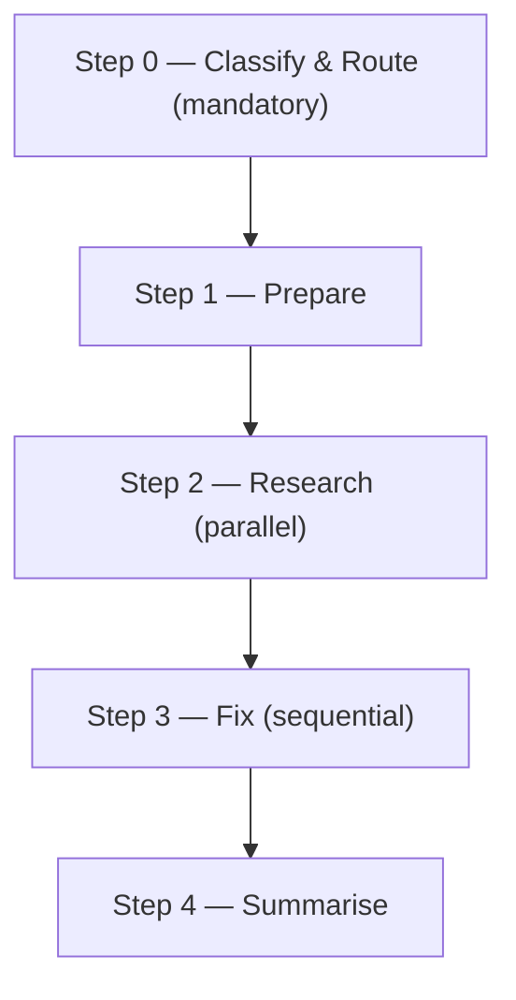

# vuln:

Researches CVEs via the NVD API, then applies dependency and code fixes one CVE at a time — each gated by a strong-reasoning code review for SIGNIFICANT / HIGH-RISK fixes — and verifies every fix against a captured test baseline.

## Who runs it

`vuln:` runs outside the PM → PA → PE → Dev pipeline. This edition records no cost attribution, so there is no phase or role label on the run's output at all — not even an inferred one. [`skills/_shared/next-phase-offer.md`](../../skills/_shared/next-phase-offer.md)'s own "Not pipeline nodes" section lists `vuln:` alongside `upgrade:`, `feedback:`, the `prompt:` family, `docs-profile:`, and the two guideline reviewers as skills that carry no next-phase offer. Run it against any repo, any time a CVE needs remediation — it is tied to no VI, Epic, or other pipeline artifact.

## Synopsis

    vuln: <JIRA-ID:CVE-ID | CVE-ID> [<JIRA-ID:CVE-ID | CVE-ID> ...]

Each argument token is either `JIRA-ID:CVE-ID` (e.g. `MGD-2423:CVE-2023-46604`) or a bare `CVE-ID` (e.g. `CVE-2023-46604`) — a Jira ID is optional per token, never required for the run as a whole. Step 1 parses each token, filters out anything that isn't a CVE pattern (`CWE-*`, OWASP patterns) with a warning, and determines the project's `NOJIRA`/`NO-JIRA` placeholder convention from recent branch names and commit history for any token missing a Jira ID. All CVEs are researched together before any fix is applied, then fixed one at a time to avoid conflicting edits to the same dependency files.

## How it runs

`vuln/SKILL.md` uses `## Step` headings, not `## Phase` — five of them, shown above. It dispatches six subagents directly, all real (`agents/*.md` exists for each): `vuln-research` (Step 2, one per CVE, batched in a single agent message), `vuln-fixer` (Step 3, sequential per `READY` CVE), `test-baseliner` (Step 3, capturing the batch baseline once for the SIGNIFICANT/HIGH-RISK path before any component is touched), `code-review` (Step 3, SIGNIFICANT/HIGH-RISK only, before tests run), `review-fixer` (Step 3, for surviving BLOCKER/MAJOR findings after triage), and `impl-maintenance` (Step 4, session lessons-learned). Only `vuln-research` and `vuln-fixer` appear as literal `task(agent_type: "dev-workflows:…")` calls in the file; `test-baseliner`, `code-review`, `review-fixer`, and `impl-maintenance` are invoked by bare name in prose ("using the existing `test-baseliner` agent", "Invoke `code-review` with…", "invoke `review-fixer` with model: …", "invoke `impl-maintenance` with…") without repeating the `dev-workflows:` prefix — a citation-style inconsistency inside the file itself, not an indirection through a `skills/_shared/` procedure, so all six are direct dispatches. No `dispatch-*`/`resolve-*` indirection appears anywhere in this skill.

## What it needs

- **At least one CVE token**, per the Synopsis grammar. Every non-CVE token is filtered out with a warning rather than silently dropped.
- **The repo path** — the run's target, snapshotted at Step 1 alongside the primary ecosystem when it's obvious, so `vuln-research` can disambiguate library detection.
- **A per-CVE classification**, finalized from the research report — not known up front, so Step 0 starts with a provisional `MODERATE` routing block for research and re-classifies once each research report returns (`READY`/`NOT_IN_REPO`/`LOOKUP_FAILED`/`SKIP_NON_CVE`). A finalized `HIGH-RISK` re-runs `vuln-research` on the strong-reasoning tier for a confirmation pass; a non-trivial `SIGNIFICANT` bump does the same when the breaking-change surface warrants it.
- **A captured test baseline** — only for the SIGNIFICANT/HIGH-RISK path, taken once at the orchestrator via `test-baseliner` and reused across every component in the batch, never re-run per component.
- **A resolved research report file** — written to a temp path (never inside a repo tree) and passed by path, never pasted, to `vuln-fixer`, `code-review`, and every resume step. An unreadable path at any of those steps is a hard stop for that CVE (marked `BLOCKED` in the Step 4 table), never retried with a freshly re-derived research pass.

## What it produces

Dependency and code fixes applied one CVE at a time, each on its own dedicated fix branch created by `vuln-fixer` (never pushed directly to `main`/`master`), with a PR opened per CVE. A Step 4 results table (`CVE | Library | Change | Class | Result | PR`), a `### Model Routing` section, and a `### Review triage` section naming every finding reviewed and every dismissal's reason for CVEs that reached Opus/strong-reasoning review. This skill never commits into the code repo it just fixed beyond what `vuln-fixer` itself commits — the terminal `commit-artifacts` step commits only `$SPECS_PATH`'s bounded session-artifact paths, printed as a `Specs repo:` line.

## Gates

Step 3's SIGNIFICANT/HIGH-RISK path dispatches `code-review` before any test run — a `BLOCK` verdict means tests do not run yet. Like every reviewer in this pipeline, `code-review` carries no `model:` pin in its own frontmatter (confirmed: zero of 34 `agents/*.md` files set one) — the orchestrator pins the model at the dispatch call site and records it as `review_model`, resolved from the strong reasoning tier (Opus 5/4.8/4.7/4.6 or GPT-5.6/5.5). `vuln/SKILL.md`'s own `model_routing` comments call this "frontmatter-pinned" four times in its prose — that phrasing is wrong on its own terms and is not repeated here. Findings are triaged first ([`finding-triage.md`](../../skills/_shared/finding-triage.md)) before any `review-fixer` dispatch: each finding is verified at the location it names, kept or dismissed with a reason, and the fixer sees survivors only. `BLOCK`/`PASS WITH RECOMMENDATIONS` invokes `review-fixer` for the surviving BLOCKER/MAJOR findings, then one re-review against a freshly refreshed diff; a still-`BLOCK` second verdict stops and escalates. The SIMPLE/MODERATE path has no Opus gate at all — `vuln-fixer` runs with `baseline_tests: run-fresh` and no review step. A `TEST_REGRESSION` result on either path is never auto-resolved: the orchestrator (this skill, in the interactive session — sub-agents cannot prompt) presents the failing tests and asks apply-anyway, revert, or investigate further.

## Example

    vuln: MGD-2423:CVE-2023-46604 CVE-2024-99999

The run researches both CVEs in parallel, finds the first present in the repo and the second not (`NOT_IN_REPO`, skipped), classifies the first from its research report (say `MODERATE`), fixes it via `vuln-fixer` with a fresh test run, opens a PR, prints the results table with `MGD-2423:CVE-2023-46604` marked `OK` and `CVE-2024-99999` marked `SKIP`, runs `impl-maintenance`, and suggests `/compact` before the next task.

## See also

- [`upgrade:`](upgrade.md) — the sibling non-pipeline workflow for planned version bumps rather than CVE remediation; shares the same per-component classification, strong-reasoning review gate, and `test-baseliner`/`code-review`/`review-fixer` dispatch shape.
- [`finding-triage.md`](../../skills/_shared/finding-triage.md) — how `code-review`'s findings are triaged before `review-fixer` sees them.
- [`context-management.md`](../../skills/_shared/context-management.md) — the read-failure contract behind "never retry by re-deriving the artifact" on an unreadable `research_file`/`claims_file`.
- [`branch-naming.md`](../../skills/_shared/branch-naming.md) — how `vuln-fixer`'s per-CVE fix branch name is resolved.
- [`model-routing.md`](../../skills/_shared/model-routing.md) — the per-CVE classification heuristics and the strong-reasoning fallback chain.
