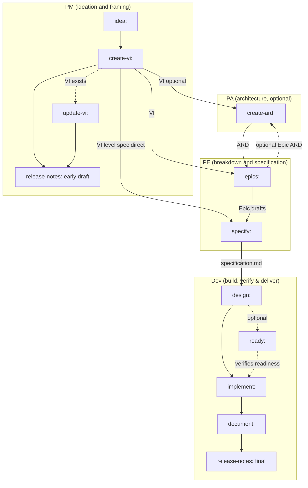

# Workflow overview

`idea:` opens a Value Increment; `document:` and the final `release-notes:` close it out. The diagram below is drawn straight from the routing graph in [`skills/_shared/next-phase-offer.md`](../skills/_shared/next-phase-offer.md) — every arrow is a next-step offer that reference actually documents, not an assumption carried over from another edition. Invocation is always `name:`, never `/name` (see [Getting started](getting-started.md#your-first-run)). `vuln:`, `upgrade:`, `feedback:`, the `prompt:` family (`prompt:`, `prompt-brainstorm:`, `prompt-grill-me:`), `docs-profile:`, and the two guideline reviewers are not pipeline nodes — `next-phase-offer.md`'s own "Not pipeline nodes" section says so — and are omitted from the diagram below.

`create-vi: <JIRA-KEY> → specify: <VI>` is a real path, not a simplification: a VI can go straight to a VI-level specification instead of through `epics:` first — `next-phase-offer.md`'s PM section offers "hand to PE → `epics: <VI>` (or `specify: <VI>`)" as alternatives on the very same menu. A VI-level `create-ard:` offers the same direct choice on its own next-step menu, once it exists.

The diagram draws `create-ard:` reaching `epics:`, but that is one edge among several this edition's architecture flow supports, and the ARD it produces is consulted by six callers, not one: `create-ard:`, `design:`, `implement:`, `specify:`, `epics:`, and `ready:` all resolve the applicable ARD once it exists ([`skills/_shared/ard-resolution.md`](../skills/_shared/ard-resolution.md)). A VI-level ARD's own next-step menu offers `epics:` (recommended) or the direct `specify: <VI>` path; an Epic-level ARD offers `specify: <VI> <Epic>` (recommended) or a direct hand to `design: <VI> <Epic>`. The edge above is drawn once to keep the diagram readable, not because the others do not consult it.

`update-vi: <KEY>` is a re-entry node, not a linear step: it is reached when `create-vi:` redirects an existing-VI call, or when a later phase forces a refresh. After its own paste-into-Jira and re-import round-trip it offers the same forward paths as `create-vi:` — `release-notes: <VI>` (PM), `create-ard: <VI>` (PA, if one exists), `epics: <VI>` (PE), and `specify: <VI>` (PE, if one exists).

`ready: <VI> [<Epic>]` is a read-only gate, not a pipeline step: `SUPPORTED` recommends `implement:`; `PARTIAL` or `NOT-SUPPORTED` recommends resolving the named gaps and re-running `ready:` rather than proceeding. `implement: <VI> <Epic>` itself fans out by Epic — finish the remaining Epics before `document:` runs, which is VI-level and runs once, after every in-scope Epic is implemented.

[Roles](roles.md) says what each role owns, consumes, and hands off at each of these seams — this diagram only shows where the skills sit.

## Roles

| Role | Runs | Produces → lands at |
|---|---|---|
| **PM** | `idea:`, `create-vi:`, `update-vi:`, and an early `release-notes:` | `idea.md` in `$VAULT_PATH`, then the VI in `$SPECS_PATH/specifications/<KEY>-<slug>/` |
| **PA** | `create-ard:` (optional) | the ARD, in the same specs feature folder as the VI |
| **PE** | `epics:`, `specify:` | Epic drafts in `$VAULT_PATH/jira-drafts/<VI-KEY>/`; `specification.md` on the specs repo's default branch |
| **Dev** | `design:`, `implement:`, `document:`, `ready:`, and a final `release-notes:` | `design.md` on the default branch; code on a branch in `$REPOS_PATH`, left uncommitted; product docs in the docs repo; a readiness verdict that sets no status |

See [Roles](roles.md) for what each role owns, consumes, and hands off — this table only shows where the skills sit.

## Artifact homes

- **`$SPECS_PATH/specifications/<KEY>-<slug>/`** — the shared, team-visible home for the VI, the ARD, `specification.md`, and `design.md`. Each authoring skill lands its file here, then hands it onto the specs repo's default branch (`handoff-to-main`, [`skills/_shared/phase-handoff.md`](../skills/_shared/phase-handoff.md) §2) for the next skill to find.
- **`$VAULT_PATH`** — the personal store: `idea.md` before a Jira key exists (under `Projects/Products/<area>/<slug>/`, or the flat `Projects/ideas/<slug>/` when no area applies), the imported `jira-products/<KEY>/` tree, `jira-drafts/<VI-KEY>/` Epic drafts, and `release-notes:` drafts.
- **`$REPOS_PATH`** — the mounted code clones. `implement:` and, outside the VI pipeline, `upgrade:` work here on a feature branch but leave changes uncommitted; `vuln:`, also outside the VI pipeline, is the one that commits and opens a pull request, per fixed CVE. Product documentation itself is written into the external docs repo — `$DOCS_PATH` only grounds `document:`'s discovery of it — never here.
- **Plugin bookkeeping** — feedback, follow-ups, and `resume.md` live under `<VI-dir>/dev-workflows/` inside `$SPECS_PATH` (or `dev-workflows-feedback/` for a keyless run), committed and pushed alongside the specs artifacts they describe ([`skills/_shared/specs-repo-git.md`](../skills/_shared/specs-repo-git.md)). Follow-up tasks are the one exception: they land in your vault first and reach this directory only when no vault is available — see [Follow-ups](reference/follow-ups.md) for the full ladder.

## Sources of truth

- **Jira** is the source of truth for workflow *status* — [`workflow-states.md`](../skills/_shared/workflow-states.md) says so outright and stores no status of its own, only interprets it. An external import tool pulls the ticket tree into `$VAULT_PATH/jira-products/<KEY>/`, every skill reads the status from there, and none writes it back. `ready:` is the skill that looks most like an exception and is not one: it verifies a declared status against the ARD/spec/design record and reports, rather than changing it.
- **The specs repo's default branch** is the source of truth for whether a phase's deliverable is actually *done*: "a workflow phase is not finished until its artifact is on the default branch" ([`skills/_shared/phase-handoff.md`](../skills/_shared/phase-handoff.md)). A producing skill lands its artifact there via `handoff-to-main`; the next skill in the chain runs `require-on-main` and refuses to start expensive work until it finds the artifact on that branch, not merely written to disk. See [Roles](roles.md) for what happens when the artifact is on an unmerged branch instead, or missing entirely.
